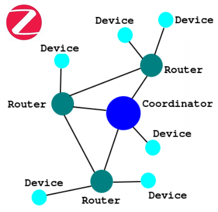

# Lecture 2 - Roles, topology, and network formation

**Course:** [Zigbee guide](../Guide.md) | **Phase 2 - Embedded Software, IoT**

**Previous:** [Lecture 01 - What Zigbee is and where it fits](Lecture-01.md) | **Next:** [Lecture 03 - The Zigbee stack: ZDO, APS, endpoints, and clusters](Lecture-03.md)

---

## The three main node roles

Zigbee networks are built from three main node types:

- **Coordinator**
- **Router**
- **End Device**

Official reference: [Silicon Labs network node types](https://docs.silabs.com/zigbee/8.2.0/zigbee-fundamentals/03-network-node-types)

### Coordinator

There is at most **one coordinator** in a Zigbee network.

Its job is to:

- form the network
- choose channel and identifiers
- anchor the network
- often act as the **trust center**

In practice, the coordinator is usually the gateway-like or mains-powered central node.

### Router

Routers:

- forward traffic
- extend network range
- allow children to attach
- stay awake instead of sleeping aggressively

A router is infrastructure, not a battery-first endpoint.

### End Device

End devices:

- do not route traffic for others
- usually communicate through a parent
- are the natural place for battery-powered sensors and actuators

Some end devices are sleepy, which matters a lot for power design later.

---

## Topologies: star, mesh, and hybrid reality

Zigbee is often described as "mesh", but the useful engineering point is more specific:

- a coordinator can anchor a network
- routers can relay traffic
- end devices can hang from a parent

That means real deployments often look **hybrid**, not like one pure textbook diagram.

Official reference: [Silicon Labs Zigbee mesh networking](https://docs.silabs.com/zigbee/8.2.1/zigbee-fundamentals/02-zigbee-mesh-networking)

This picture is useful because it shows the role split visually:

- one **Coordinator** at the center
- several **Routers** extending the network
- several leaf **Devices** hanging from routing infrastructure

Source: [eMcU Home Automation Zigbee topology image](https://www.emcu-homeautomation.org/wp-content/uploads/2021/06/immagine-111.png)

In practice:

- a small deployment may behave almost like a star
- a larger deployment uses routers for reach and resilience
- sleepy end devices remain leaves

So the real question is not "is it star or mesh?" but:

- who routes?
- who sleeps?
- who forms the network?
- where are the failure points?

---

## How a Zigbee network forms

At a high level:

1. a coordinator scans and selects a channel
2. it creates the network
3. routers and end devices discover and join
4. parents are selected
5. routing state develops as the network grows

This is the basic bring-up flow you must hold in your head before touching SDK examples.

Key detail:

- the coordinator has special formation responsibility
- once the network exists, routers and parent relationships matter more for daily operation

---

## Trust center and management implications

The coordinator is not just the first router.

In many Zigbee deployments it also acts as the **trust center**, which means it is central to:

- authorization
- key handling
- network admission

That is one reason coordinator design quality matters so much. If the coordinator is weakly implemented, the whole network suffers.

---

## The embedded-design consequence

When you choose a Zigbee role in firmware, you are not making a cosmetic setting. You are choosing:

- power behavior
- RAM/flash pressure
- radio duty cycle
- routing responsibility
- security responsibility

That is why roles belong in Embedded Software, not only in networking diagrams.

---

## Lab

Draw a small 6-device Zigbee network and label:

- one coordinator
- two routers
- three end devices

Then answer:

- which nodes must stay awake?
- which nodes can reasonably sleep?
- which node is most likely to act as trust center?

---

**Previous:** [Lecture 01 - What Zigbee is and where it fits](Lecture-01.md) | **Next:** [Lecture 03 - The Zigbee stack: ZDO, APS, endpoints, and clusters](Lecture-03.md)
