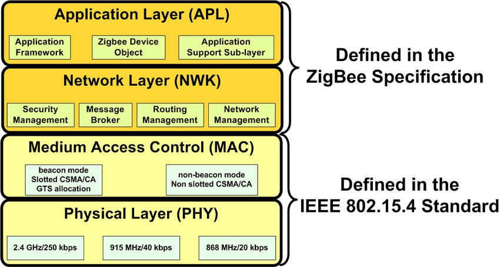

# Lecture 3 - The Zigbee stack: ZDO, APS, endpoints, and clusters

**Course:** [Zigbee guide](../Guide.md) | **Phase 2 - Embedded Software, IoT**

**Previous:** [Lecture 02 - Roles, topology, and network formation](Lecture-02.md) | **Next:** [Lecture 04 - Security, commissioning, sleepy devices, and OTA](Lecture-04.md)

---

## Why this lecture feels hard

This is the lecture where Zigbee often stops feeling simple.

Up to now, the story is easy:

- devices join a network
- some devices route
- some devices sleep

Then Zigbee starts throwing around words like:

- `NWK`
- `APS`
- `ZDO`
- `ZCL`
- endpoint
- cluster

and everything starts to sound like spec language.

So this lecture uses one simple analogy all the way through.

Official reference: [Silicon Labs The Zigbee Stack](https://docs.silabs.com/zigbee/8.2.1/zigbee-fundamentals/05-the-zigbee-stack)

---

## Imagine a huge house party

Imagine you are throwing a huge house party.

Your house is full.

Your friends are spread across:

- your house
- the yard
- the garage
- your neighbor's house

Some people help pass messages around.
Some people just show up, listen, and leave.
Some people are in charge of the whole event.

That is a good mental model for Zigbee.

Now imagine you want one thing to happen:

- you press the wall switch
- the smart bulb turns on

To make that happen, the system has to answer four questions:

1. **How do we get the message there?**
2. **Who exactly should receive it?**
3. **What does the message mean?**
4. **Who is in charge, and who is who?**

Those four questions map to:

- `NWK` = how do we get there?
- `APS` = who exactly should receive it?
- `ZCL` = what does the message mean?
- `ZDO` = who are you, and what are the rules?

If you remember only that mapping, the rest of Zigbee becomes much easier to read.

---

## The stack in one picture

At a high level:

- **PHY / MAC** come from IEEE 802.15.4
- **NWK** handles network behavior and routing
- **APS** handles application-oriented delivery
- **ZDO** handles device identity, discovery, and management
- **ZCL** defines common application behavior

This picture is useful because it shows two important facts:

- `PHY` and `MAC` are the radio foundation from IEEE 802.15.4
- Zigbee adds higher-level pieces that make devices understandable, not just reachable

Source: [Electrical Technology ZigBee Architecture diagram](https://www.electricaltechnology.org/wp-content/uploads/2017/07/ZigBee-Architecture.png)

---

## Meet the Zigbee party crew

### 1. `NWK` - the neighborhood map and hall monitors

`NWK` means **Network Layer**.

At the party, this is:

- the people who know the map
- the people who know which houses connect to which
- the people who pass notes through the best route

Their job is:

- know which device is reachable through which router
- forward the message hop by hop
- recover if one route stops working

So if a message has to travel like this:

- Switch -> Router A -> Router B -> Bulb

that is `NWK` doing its job.

Simple version:

- `NWK` answers: **how do we get there?**

---

### 2. `APS` - the mailroom and the address book

`APS` means **Application Support Sublayer**.

At the party, this is:

- the mailroom staff
- the people holding the address book
- the people who make sure the note goes to the right person in the right room

This matters because reaching the right house is not enough.

You also need to reach:

- the right device
- the right function inside that device

That is why `APS` works closely with:

- endpoints
- binding
- delivery behavior

Simple version:

- `APS` answers: **who exactly should receive this?**

---

### 3. `ZCL` - the shared party slang

`ZCL` means **Zigbee Cluster Library**.

At the party, this is:

- the shared slang everybody understands

You do not want every brand of bulb and switch speaking a different private language.

You want a common language like:

- `On`
- `Off`
- `Toggle`
- `Move to Level`

That is what `ZCL` gives you.

It defines common behavior so different vendors can still cooperate.

Simple version:

- `ZCL` answers: **what does this message mean?**

---

### 4. `ZDO` - the host and the principal

`ZDO` means **Zigbee Device Object**.

At the party, this is:

- the host
- the principal
- the person checking the guest list
- the person introducing people
- the person deciding who plays which role

`ZDO` handles questions like:

- who are you?
- are you a Coordinator, Router, or End Device?
- what endpoints do you have?
- what kind of device are you?
- what can you do?

This is management and discovery, not normal user commands.

Simple version:

- `ZDO` answers: **who are you, and what are the rules?**

---

## The most important support words

Before the full story, you need three more terms.

### Node

A **node** is the physical device.

Examples:

- one bulb
- one wall switch
- one sensor

### Endpoint

An **endpoint** is a logical application instance inside the device.

One physical node can expose:

- one endpoint for lighting
- another endpoint for sensing

So:

- node = the whole person at the party
- endpoint = the specific role that person is playing

### Cluster

A **cluster** is a reusable feature block.

Examples:

- `On/Off`
- `Level Control`
- `Temperature Measurement`

So:

- endpoint = which application instance
- cluster = which feature

---

## Attributes and commands

Inside a cluster, you usually care about two things:

- **attributes** = state values
- **commands** = actions

Examples:

- an `On/Off` cluster may support commands like `On`, `Off`, and `Toggle`
- a temperature cluster may expose an attribute like `Measured Value`

This is the daily Zigbee model:

- read an attribute
- write an attribute
- send a command

That is more useful than thinking only:

- send packet
- receive packet

---

## The full party flow

Now let us walk through one simple event:

- you press a Zigbee wall switch
- a Zigbee bulb turns on

### Step 1: the devices are already at the party

The network already exists.

The Coordinator formed it earlier.

The switch joined.

The bulb joined.

So now everyone is "in the party."

### Step 2: `ZDO` helps everyone understand who is who

Before useful control happens, devices need identity and discovery information.

The system needs to learn things like:

- this is the bulb
- this is the switch
- the bulb exposes a lighting endpoint
- the bulb supports the `On/Off` cluster

This is `ZDO` territory.

It is not saying:

- turn on the light

It is saying:

- who are you and what do you support?

### Step 3: the target endpoint is known

Suppose the bulb exposes:

- endpoint `1` for lighting

Now the system knows not only:

- which node is the bulb

but also:

- which application instance inside the bulb should receive the lighting message

### Step 4: the correct cluster is known

The bulb's endpoint `1` supports:

- `On/Off`

Now the system knows:

- the right node
- the right endpoint
- the right cluster

### Step 5: the switch creates a `ZCL` command

The user presses the switch.

The switch creates the standard application command:

- `On`

That is a `ZCL` meaning.

It is not just raw bytes.

It is a standard command with shared meaning.

### Step 6: `APS` addresses it properly

Now `APS` takes over.

`APS` makes sure the command is directed to:

- the correct destination node
- the correct destination endpoint
- the correct application target

This is the part that turns:

- "send this somewhere"

into:

- "send this lighting command to the bulb's light-control endpoint"

### Step 7: `NWK` routes it through the mesh

If the bulb is not directly reachable, `NWK` finds the path.

For example:

- Switch -> Router A -> Router B -> Bulb

That is the routing story.

`NWK` does not decide what `On` means.

It only makes sure the message travels across the network.

### Step 8: the bulb understands the command

The bulb receives the message.

Its application side sees:

- endpoint = `1`
- cluster = `On/Off`
- command = `On`

Now the bulb turns on.

That whole flow shows the layer split very clearly:

- `ZDO` helped identify devices and capabilities
- `APS` made sure the message reached the right application target
- `NWK` got the message there through the mesh
- `ZCL` gave the command meaning

---

## Binding: the saved relationship

**Binding** is like keeping a saved relationship in the party address book.

Instead of asking every time:

- which bulb should this switch control?

the system can remember:

- this switch endpoint is bound to that bulb endpoint

That makes control cleaner and reduces repeated lookup work.

Simple version:

- binding = **remember who talks to whom**

---

## Groups: one message for many devices

**Groups** are like a party group chat.

Instead of sending:

- one command to bulb A
- one command to bulb B
- one command to bulb C

you can send:

- one command to the "living room lights" group

Then all bulbs in that group respond.

Simple version:

- group = **one message for many devices**

---

## Common confusion to avoid

### Confusion 1: `ZDO` and `ZCL` sound similar

They are not doing the same job.

- `ZDO` = identity, discovery, management
- `ZCL` = commands, attributes, application meaning

One asks:

- who are you?

The other says:

- turn on

### Confusion 2: people skip `APS`

Beginners often think:

- the network sends the message
- the application receives it

But Zigbee is more structured than that.

`APS` is important because it handles delivery to the correct application target.

### Confusion 3: node and endpoint are not the same

- node = physical device
- endpoint = logical application inside the device

One physical device can have multiple endpoints.

---

## In one nutshell

For Zigbee:

- `NWK` = **how do we get there?**
- `APS` = **who exactly should receive this?**
- `ZCL` = **what does the message mean?**
- `ZDO` = **who are you, and what are the rules?**

That is the whole lecture in one summary.

---

## Why embedded engineers should care

In firmware, Zigbee is not just:

- initialize radio
- join network
- send bytes

It is more like:

- define endpoints
- pick clusters
- expose attributes
- support commands
- manage relationships between devices

That is why Zigbee feels more like building a structured device model than just pushing bits through a transport.

---

## Lab

Use the party analogy on one device:

- smart bulb
- wall switch
- temperature sensor

Write down:

1. what the physical node is
2. what endpoint or endpoints it likely has
3. which cluster matters most
4. one attribute or command it likely supports
5. one thing `ZDO` would help discover about it
6. one place where `APS` matters
7. one place where `NWK` matters

If you can explain your device using those seven steps, then the Zigbee stack is starting to become practical instead of abstract.

---

**Previous:** [Lecture 02 - Roles, topology, and network formation](Lecture-02.md) | **Next:** [Lecture 04 - Security, commissioning, sleepy devices, and OTA](Lecture-04.md)
