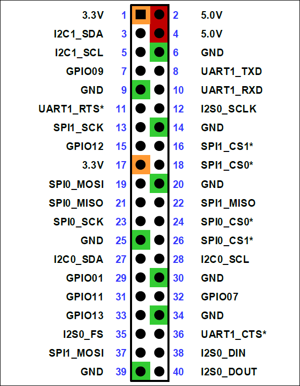

# Lecture 2 — Build, load, and board policy on Jetson

**Course:** [Jetson ESP-Hosted Host Code guide](../Guide.md) · **Phase 2 — Embedded Linux**

**Previous:** [Lecture 01](Lecture-01.md) · **Next:** [Lecture 03 — SPI transport and IRQs](Lecture-03.md)

---

## 1. Start with the shell script, not the C files

Read:

- `esp_hosted_ng/host/jetson_orin_nano_init.sh`

This file tells you the validated board assumptions:

- `RESETPIN=-1`
- `HANDSHAKEPIN=471`
- `DATAREADYPIN=433`
- `SPI_BUS_NUM=0`
- `SPI_CHIP_SELECT=0`
- `SPI_MODE=2`
- `CLOCKSPEED=10`

This is not random configuration. It is the **board policy layer** for the Jetson dev kit.

Embedded Linux takeaway:

- upstream code often assumes one board
- production bring-up usually needs a board-specific wrapper or policy layer

## Related Linux kernel concepts

This lecture lines up best with:

- [OS Lecture 5 — Kernel Modules, Boot Process & Device Tree](../../../../Phase%201%20-%20Foundational%20Knowledge/3.%20Operating%20Systems/Lectures/Lecture-05.md)
- [OS Lecture 17 — Linux Device Driver Model & Device Tree](../../../../Phase%201%20-%20Foundational%20Knowledge/3.%20Operating%20Systems/Lectures/Lecture-17.md)

Lecture 5 explains why loadable modules and board description are separate concerns: the board says what hardware exists, and the module provides behavior for it. That separation is exactly why `jetson_orin_nano_init.sh` can focus on Jetson policy while `esp32_spi.ko` focuses on transport and subsystem integration.

Lecture 17 explains driver binding and the Linux device model, which is the right mental model for the `spidev` unbind step. The script is not “doing something hacky”; it is clearing a generic driver off a real SPI device so the intended driver can bind to the same kernel object.

The important Embedded Linux idea here is that “loading a module” is not the same as “hardware is now usable.” A module can load successfully and still fail to bind the right device, fail to claim the right GPIOs, or fail later when it tries to register itself with Wi‑Fi or Bluetooth subsystems.

That is also why this lecture spends so much time on shell script policy. In real systems, a small wrapper script often carries the board truth: which bus is real, which GPIO numbering scheme the kernel expects, whether reset is safe to drive, and whether a generic placeholder driver like `spidev` must be removed first.

The kernel interfaces and concepts to watch here are:

- out-of-tree kernel modules
- `insmod` and `module_param(...)`
- device ownership and driver binding
- device tree exposing a bus before the real driver claims it

The defaults are stated directly in the helper:

```bash
IF_TYPE="spi"
MODULE_NAME="esp32_spi.ko"
RESETPIN=-1
HANDSHAKEPIN=471
DATAREADYPIN=433
SPI_BUS_NUM=0
SPI_CHIP_SELECT=0
SPI_MODE=2
CLOCKSPEED=10
```

That small block captures most of the Jetson-specific policy:

- SPI transport, not SDIO
- bus `0`, chip-select `0`
- legacy global GPIOs `471` and `433`
- reset disabled by default because board behavior mattered more than theoretical convenience

---

## 2. Map the Jetson header before you trust the GPIO numbers

The ESP-Hosted helper uses Linux GPIO numbers like `471` and `433`, but those are **not** the same thing as the Jetson's physical 40-pin header labels.

Use this NVIDIA carrier-board pin reference first:



Source: [NVIDIA Jetson Orin Nano carrier-board pin header diagram](https://developer.download.nvidia.com/embedded/images/jetsonOrinNano/user_guide/images/jonano_cbspec_figure_3-1_white-bg.png#only-light)

For ESP-Hosted over SPI, the header pins you care about most are:

- SPI1 MOSI: pin `19`
- SPI1 MISO: pin `21`
- SPI1 SCK: pin `23`
- SPI1 CS0: pin `24`
- SPI1 CS1: pin `26`
- Ground: pins `6`, `9`, `14`, `20`, `25`, `30`, `34`, `39`

This picture is useful because it keeps two different numbering systems separate:

- **header pin numbers** like `19` and `24`, which are physical connector locations
- **Linux GPIO numbers** like `471` and `433`, which are kernel-visible IDs used by the driver helper

That distinction matters in real bring-up. You wire by **header pin**, but you debug the helper script and module parameters with **Linux GPIO numbers**.

---

## 3. Why `resetpin=-1` is a serious engineering choice

The validated Jetson flow intentionally used:

- `resetpin=-1`

That means the host driver does **not** drive ESP reset by default.

Why that mattered on real hardware:

- Jetson-driven reset could interfere with ESP boot
- it could also interfere with USB flashing from another host
- a manual ESP reset after module load proved more reliable

This is an Embedded Linux lesson many people miss:

- reset is not “just another GPIO”
- reset is a board-level control policy

You can still design a later automation path, but stable bring-up comes first.

---

## 4. Understand the module build path

Read:

- `esp_hosted_ng/host/Makefile`

The most important detail is:

- `target ?= sdio`
- but Jetson bring-up uses `target=spi`

So the actual module becomes:

- `esp32_spi.ko`

The `Makefile` assembles:

- transport-specific sources:
  - `spi/esp_spi.o`
- common sources:
  - `main.o`
  - `esp_cfg80211.o`
  - `esp_bt.o`
  - `esp_cmd.o`
  - `esp_utils.o`
  - `esp_stats.o`
  - `esp_debugfs.o`
  - `esp_log.o`

That split is exactly what you want to see in a portable Embedded Linux driver:

- one transport-specific module slice
- one mostly transport-agnostic Linux integration layer

The `Makefile` says that very directly:

```make
target ?= sdio
MODULE_NAME := esp32_$(target)

ifeq ($(target), spi)
    ccflags-y += -I$(src)/spi -I$(CURDIR)/spi
    EXTRA_CFLAGS += -I$(M)/spi
    module_objects += spi/esp_spi.o
endif

module_objects += esp_bt.o main.o esp_cmd.o esp_utils.o \
                  esp_cfg80211.o esp_stats.o esp_debugfs.o esp_log.o

obj-m := $(MODULE_NAME).o
$(MODULE_NAME)-y := $(module_objects)
```

That tells you:

- `target=spi` chooses the transport glue
- the Wi-Fi, Bluetooth, and lifecycle files are shared
- the final kernel object is assembled as `esp32_spi.ko`

---

## 5. Why the script unbinds `spidev`

In the Jetson path, the helper script can unbind:

- `spi0.0` from `spidev`

Why this is necessary:

- the device tree exposed the SPI bus to Linux
- but the generic `spidev` driver may already own that SPI device
- the real host module cannot use it cleanly until that generic binding is removed

This is a classic Embedded Linux pattern:

- first you prove the bus exists with a generic tool path
- then you disable the generic owner so the real subsystem driver can claim it

That is the difference between “bus visible” and “system integrated.”

The exact unbind step is short and very revealing:

```bash
if [ "$driver_name" = "spidev" ]; then
	echo "Unbinding ${spi_dev} from spidev for this boot..."
	echo "$spi_dev" | sudo tee /sys/bus/spi/drivers/spidev/unbind > /dev/null
	return
fi
```

This is a nice Embedded Linux lesson because the shell script is not “doing driver work.” It is clearing a device-model conflict so the real subsystem driver can reuse `spi0.0`.

---

## 6. Module parameters: board-specific without recompiling

Read:

- `esp_hosted_ng/host/main.c`
- `esp_hosted_ng/host/spi/esp_spi.c`

The Jetson fork adds module parameters for:

- `resetpin`
- `clockspeed`
- `spi_bus_num`
- `spi_chip_select`
- `spi_handshake_gpio`
- `spi_dataready_gpio`
- `spi_mode`

Why this matters:

- the original board assumptions no longer have to be compiled in
- board mapping becomes a load-time decision
- debugging bus and GPIO problems becomes much faster

That is exactly how Embedded Linux code should evolve when it leaves a single-board tutorial phase.

---

## 7. The real meaning of the validated load command

The working Jetson load path was logically equivalent to:

```bash
sudo insmod ./esp32_spi.ko \
  resetpin=-1 \
  clockspeed=10 \
  spi_bus_num=0 \
  spi_chip_select=0 \
  spi_handshake_gpio=471 \
  spi_dataready_gpio=433 \
  spi_mode=2
```

What that tells you:

- this driver is board-aware at module load time
- the board-specific choices are separated from the compiled code
- the Linux subsystem integration does not need to know Jetson header pin numbers directly

Instead, the driver consumes:

- Linux SPI bus selection
- Linux chip select
- Linux legacy global GPIO numbers

That is exactly the level the kernel expects.

The helper constructs the final `insmod` arguments explicitly:

```bash
insmod_args=(
	resetpin="$RESETPIN"
	clockspeed="$CLOCKSPEED"
	raw_tp_mode="$RAW_TP_MODE"
	spi_bus_num="$SPI_BUS_NUM"
	spi_chip_select="$SPI_CHIP_SELECT"
	spi_handshake_gpio="$HANDSHAKEPIN"
	spi_dataready_gpio="$DATAREADYPIN"
	spi_mode="$SPI_MODE"
)

sudo insmod "$MODULE_NAME" "${insmod_args[@]}"
```

That is the practical handoff from board policy into the kernel module.

---

## Lab

Answer these:

1. Which settings in `jetson_orin_nano_init.sh` are clearly board-specific?
2. Which settings are protocol-specific rather than board-specific?
3. Why is `spidev` unbinding a Linux integration problem, not just a shell-script problem?
4. Why is `resetpin=-1` a reasonable default for bring-up?

---

**Previous:** [Lecture 01](Lecture-01.md) · **Next:** [Lecture 03 — SPI transport and IRQs](Lecture-03.md)
