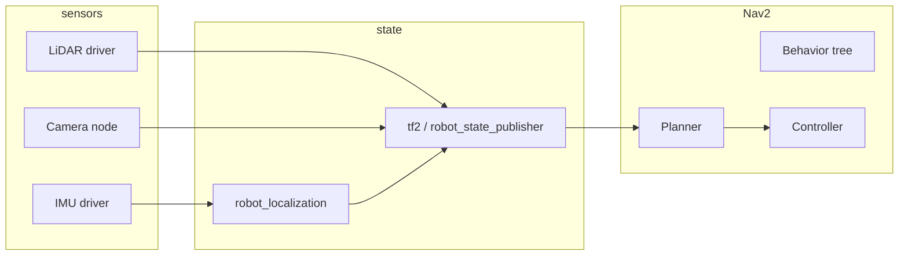

# Lecture 1: Advanced Robot Operating System (ROS / ROS 2)

## Overview

This lecture treats **ROS 2** as the integration layer between **sensors**, **estimators**, **planners**, and **actuators** on real robots. Unlike a shallow tutorial that only publishes strings on a topic, the goal here is a **systems** view: you can explain why Nav2 drops commands when TF is wrong, why a bag replay desynchronizes without matching QoS, and how manipulation and navigation coexist in one compute graph.

**By the end of this lecture you should be able to:**

* Draw the ROS 2 **compute graph** for a mobile manipulator (base + arm) and name the main message types on each edge.
* Configure **DDS QoS** for sensor streams vs low-rate commands and justify the choice.
* Trace a navigation failure through **TF2**, **costmaps**, and **Nav2** recovery behaviors.
* Compare **SLAM** back ends (SLAM Toolbox, Cartographer, RTAB-Map) at a “which tool for which robot” level.
* Describe how **`robot_localization`** fuses odometry and IMU into a filtered state for Nav2.
* Outline the **MoveIt 2** planning scene → planner → trajectory → `ros2_control` execution path.

---

## Recommended courses (this track)

Structured courses that align with this lecture (full catalog: [The Construct — Robotics & ROS](https://www.theconstruct.ai/robotigniteacademy_learnros/ros-courses-library/)):

* [ROS 2 Basics in Python](https://app.theconstruct.ai/courses/ros2-basics-in-5-days-v2-python-268/) or [ROS 2 Basics in C++](https://app.theconstruct.ai/courses/ros2-basics-in-5-days-c-325/) — pick one language first, then add the other.
* [TF ROS 2](https://app.theconstruct.ai/courses/tf-ros2-217/) — frames and `robot_state_publisher` patterns.
* [Intermediate ROS 2](https://app.theconstruct.ai/courses/intermediate-ros2-113/) — launch, parameters, QoS, lifecycle.
* [ROS 2 Navigation](https://app.theconstruct.ai/courses/ros2-navigation-galactic-109/) and [Advanced ROS 2 Navigation](https://app.theconstruct.ai/courses/advanced-ros2-navigation-116/) — Nav2-style stacks.
* [ROS 2 Manipulation Basics](https://app.theconstruct.ai/courses/ros2-manipulation-basics-81/) or [ROS 2 Manipulation & Perception](https://app.theconstruct.ai/courses/ros2-manipulation-perception-master-103/) — MoveIt 2–style manipulation.
* [Robotics Specialization](https://www.coursera.org/specializations/robotics) (University of Pennsylvania) — aerial robotics, planning, perception, mobility, capstone; strong on math and control (often MATLAB in assignments; not ROS-version-specific).

**Official references (bookmark these):**

* [ROS 2 documentation](https://docs.ros.org/) (pick your distro: Humble / Jazzy / Rolling).
* [Navigation2](https://navigation.ros.org/)
* [MoveIt 2](https://moveit.picknik.ai/)
* [ros2_control](https://control.ros.org/)

---

## 1. ROS 2 architecture: graph, DDS, and executors

### 1.1 Mental model

ROS 2 replaces the ROS 1 master with **DDS** (Data Distribution Service). Every node discovers peers on the network; **topics** are multicast-friendly streams; **services** are RPC; **actions** are long-running goals with feedback (used heavily by Nav2 and MoveIt 2).



### 1.2 QoS: why your bag “almost” works

**Quality of Service** profiles control reliability, history, and deadline. Common mistake: recording a topic with **best-effort** sensors and replaying with **reliable** subscribers, or the reverse—then messages silently drop or stall.

| Traffic type | Typical reliability | Notes |
|--------------|---------------------|--------|
| Camera / LiDAR at high rate | Often **best effort** | Lossy OK; reduce backlog |
| Command / goal | **Reliable** | Must arrive |
| TF (if using `/tf` heavily) | Match publisher | Mismatches cause missing transforms |

**Practical rule:** For debugging, align **publisher and subscriber QoS**; use `ros2 topic info -v` to inspect endpoints.

### 1.3 Lifecycle nodes

Many Nav2 and ros2_control components are **managed nodes** (unconfigured → inactive → active). Launch files bring the stack up in order; a node in the wrong state yields empty behavior trees or zero velocity. When something “does nothing,” check **lifecycle state** before diving into parameters.

### 1.4 Executors and threading

Single-threaded executors are simpler; **multi-threaded** executors help when callbacks must not block each other (e.g. heavy perception). Cost: you must reason about **locks** and **callback re-entrancy**. For learning, start single-threaded; add threads when profiling shows starvation.

---

## 2. TF2: the spine of robotics integration

**TF2** maintains a **time-varying tree** of coordinate frames: `map` → `odom` → `base_link` → `sensor_frame` → `tool0`. Nav2 expects consistent **map–odom–base_link** semantics; manipulation expects **base_link–arm–gripper**.

**Common failures**

* **Missing transform:** Usually forgotten `static_transform_publisher`, wrong timestamp, or sensor publishing in the wrong frame.
* **Extrapolation into the future:** `tf2` buffers are finite; if your sensor time is wrong (sim clock vs wall clock), lookups fail.

**Debugging commands**

* `ros2 run tf2_tools view_frames` (generate PDF of the tree).
* `ros2 topic echo /tf --once` combined with `tf2_monitor`.

**Study focus:** Be able to explain, in one sentence, what each of `map`, `odom`, and `base_link` means and why **odom drifts** but **map** (after localization) does not.

---

## 3. Tools: bags, RViz2, rqt, launch

| Tool | Use |
|------|-----|
| `ros2 bag record` / `play` | Reproduce bugs without hardware; tune Nav2 on identical data |
| `rviz2` | Visualize TF, costmaps, laser scans, planned paths |
| `rqt_graph` / `rqt` | Inspect graph and tune dynamic parameters |
| `ros2 launch` | Compose parameterized stacks; use YAML for overrides |

**Bag workflow:** Record **all inputs** needed to replay the failure (TF, scans, cmd_vel, odometry). Name bags with **date + scenario**; document ROS distro and package versions alongside.

---

## 4. Nav2: navigation stack

Nav2 is a **behavior-tree-driven** stack: it selects among **compute path**, **follow path**, **recovery** (spin, backup, wait), and **global localization** behaviors depending on costmap state and planner feedback.

### 4.1 Costmaps

* **Global costmap:** Long-horizon planning over mostly static obstacles.
* **Local costmap:** Short horizon, updated fast; feeds the **controller** (often DWB, RPP, or similar plugins).

Inflation layers turn obstacles into **gradients** so the robot does not graze corners. Wrong **footprint** or **inflation radius** is a top cause of “robot never enters doorways.”

### 4.2 Planners

**Global planner** examples: NavFn, Smac Planner (grid-based, often better in structured spaces). **Controller** follows the local costmap and produces `cmd_vel`. When the robot oscillates or stops, split the issue: **global path** vs **local tracking**.

### 4.3 Recovery

Recoveries exist because **local minima** happen in real buildings. Learn to read **Nav2 logs** to see which recovery fired and why.

---

## 5. SLAM and localization

You rarely “use SLAM” as a black box without choosing a **map representation** and **sensor suite**.

| Package | Typical use | Notes |
|---------|-------------|--------|
| **SLAM Toolbox** | 2D LiDAR, lifelong mapping | Popular on mobile bases |
| **Cartographer** | 2D/3D, submaps | Tuning can be involved |
| **RTAB-Map** | RGB-D, stereo, LiDAR | Strong when cameras are primary |

**Localization without mapping:** Once a map exists, **AMCL** (or equivalent) localizes the robot in the map. Nav2 expects a consistent **map → odom** transform from localization fused with odometry.

---

## 6. Sensor fusion: `robot_localization`

`robot_localization` implements **EKF/UKF** to fuse **wheel odometry**, **IMU**, **GPS** (outdoor), and optional visual odometry into a smooth `odom` → `base_link` estimate. You configure **which sensors update which state components** (e.g. IMU for orientation, wheels for x,y).

**Why it matters:** Raw wheel encoders slip; IMU drifts; fusion gives Nav2 a **stable velocity and heading** for control.

---

## 7. `ros2_control`: from messages to torque

**ros2_control** separates **hardware interfaces** (read joints / write efforts) from **controllers** (PID, trajectory following). MoveIt 2 typically sends **trajectories** to a trajectory controller; mobile bases use **diff_drive** or similar.

Conceptual pipeline:

```text
MoveIt 2 → trajectory_msgs/JointTrajectory → trajectory_controller → hardware_interface → driver
```

You do not need to write a custom hardware interface on day one, but you **do** need to know which **controller is active** and which **joint names** match the URDF.

---

## 8. MoveIt 2: manipulation

**MoveIt 2** connects **perception (optional)** → **planning scene** (collision geometry) → **motion planner** (OMPL, Pilz, CHOMP, …) → **trajectory execution**.

* **Planning scene:** Mesh and primitive obstacles; often updated from depth or table plane segmentation.
* **Planning groups:** Arm vs gripper; **end-effector** poses are planned in Cartesian or joint space.
* **Pipeline integration:** Pick-and-place is **state machine** glue: locate object → plan approach → grasp → retreat → place.

---

## 9. Integrated projects (from this roadmap)

* **Autonomous mobile robot:** SLAM → map → AMCL → Nav2 → goal poses in RViz2; log a bag and replay after changing costmap parameters.
* **Robotic arm:** URDF + MoveIt 2 config → plan in RViz2 → execute on sim (`ros2_control` + Gazebo) then on hardware if available.

---

## 10. Self-check

1. Explain the difference between **`map`→`odom`** and **`odom`→`base_link`** transforms.
2. Name two reasons Nav2 would publish **zero velocity** despite a valid goal.
3. Why might **increasing LiDAR rate** make TF lookups fail if timestamps are inconsistent?
4. What does **`robot_localization`** improve compared to raw wheel odometry alone?

---

## Resources

* **Structured courses:** See **Recommended courses** above; the [main Robotics Application guide](../Guide.md) lists all tracks (§1–§3).
* **"Programming Robots with ROS"** by Quigley, Gerkey, and Smart — ROS concepts (ROS 1 heritage; still useful for ideas; pair with ROS 2 docs).
* **ROS 2 documentation:** [docs.ros.org](https://docs.ros.org/)
* **MoveIt 2 documentation:** [moveit.picknik.ai](https://moveit.picknik.ai/)

---

## Next in this roadmap

* **Industrial deployment, simulation, embedded:** [Lecture 2 — Industrial and Embedded Robotics](../Industrial%20and%20Embedded%20Robotics/Lecture-01.md)
* **Perception, tracking, deep learning:** [Lecture 3 — Advanced Perception and AI for Robotics](../Advanced%20Perception%20and%20AI%20for%20Robotics/Lecture-01.md)
