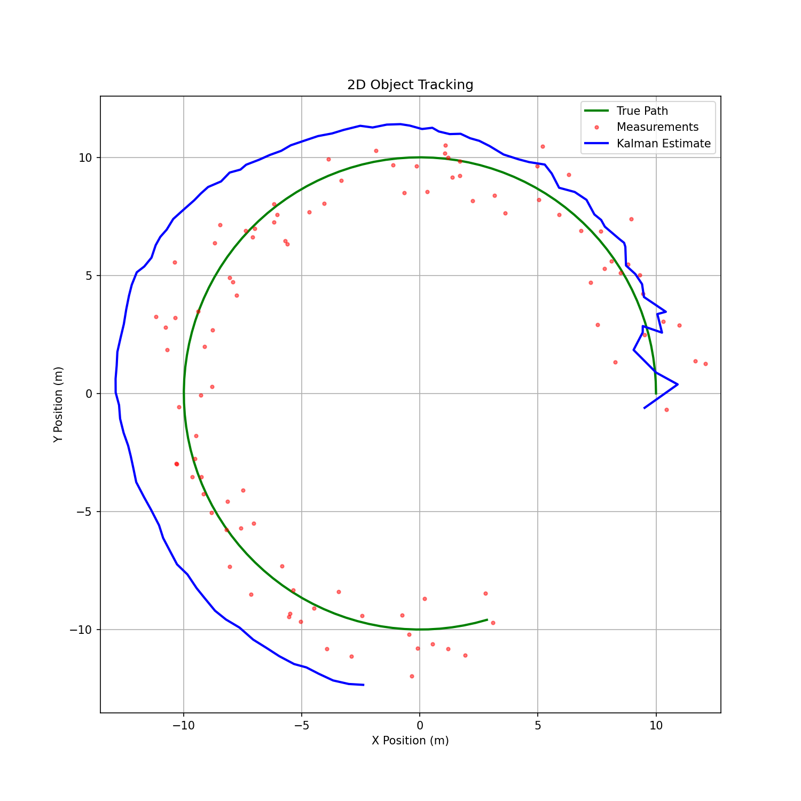
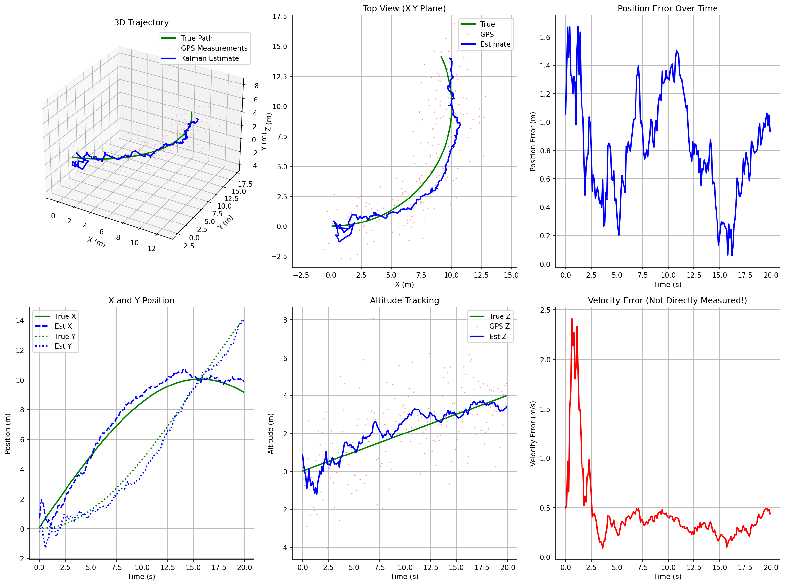

# Kalman Filter Learning Series

Part of the [AI Hardware Engineer Roadmap](../../../../README.md).

## Learning Path

| Level | Chapters |
|-------|----------|
| **Start** | [00 - Index](00-index.md) |
| **Elementary** | [01](01-what-is-estimation.md) · [02](02-noisy-measurements.md) · [03](03-combining-information.md) |
| **Middle School** | [04](04-averages-and-uncertainty.md) · [05](05-weighted-averages.md) · [06](06-prediction.md) |
| **High School** | [07](07-kalman-filter-idea.md) · [08](08-1d-kalman-filter.md) · [09](09-tracking-moving-object.md) |
| **Undergraduate** | [10](10-matrix-form.md) · [11](11-multidimensional-kf.md) |

## Reference

- [Cheat Sheet](cheat-sheet.md)
- [Sensor Fusion Guide](../Guide.md)

## Example Outputs





## Run

```bash
pip install numpy matplotlib
python kalman_1d.py   # or kalman_2d.py, kalman_6d.py
```

## External

- [Kalman Filter (Wikipedia)](https://en.wikipedia.org/wiki/Kalman_filter)
- [Roger Labbe's Book](https://github.com/rlabbe/Kalman-and-Bayesian-Filters-in-Python)
