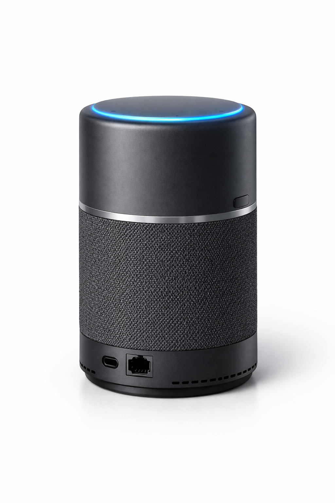
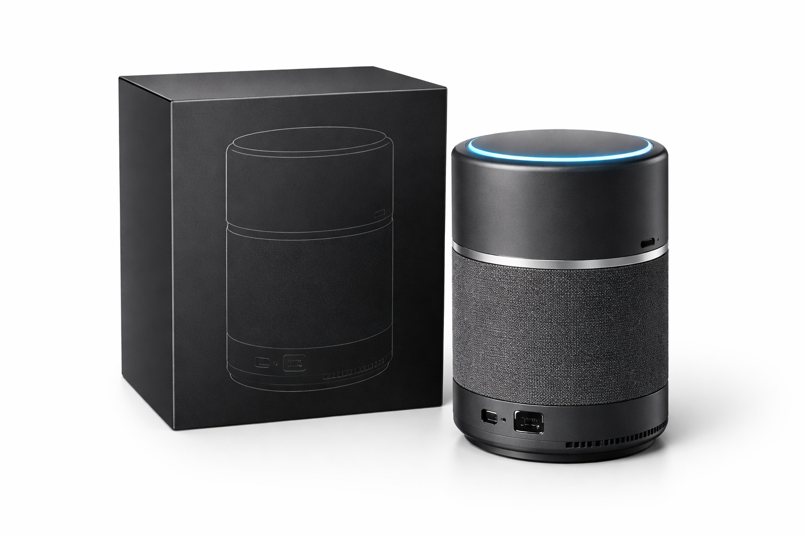
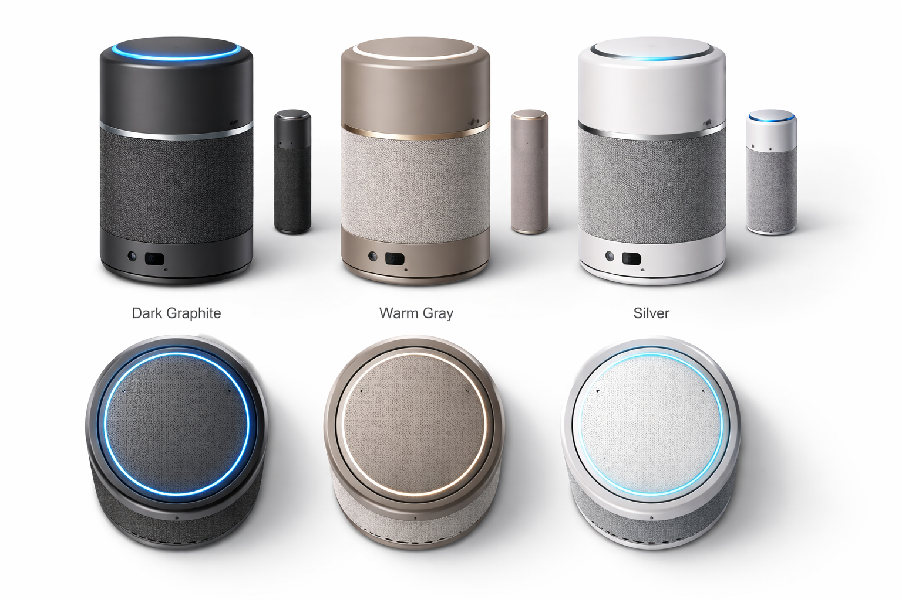
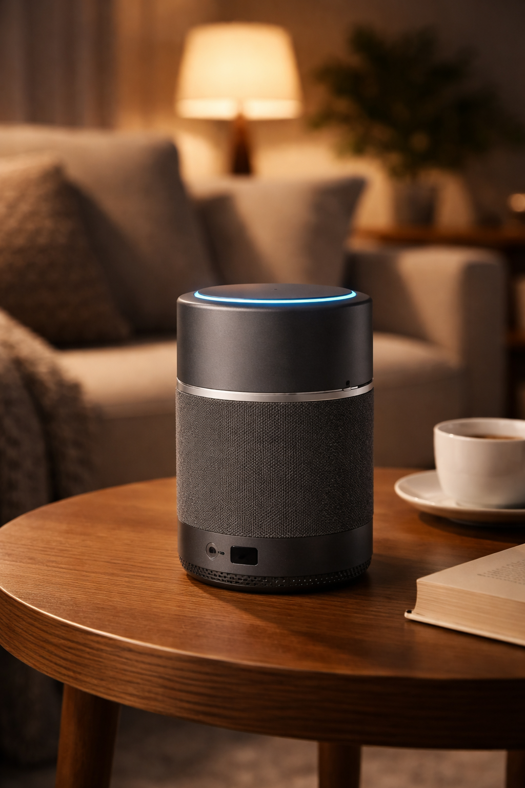
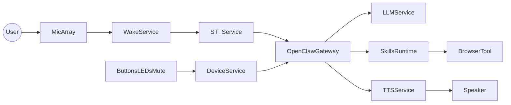
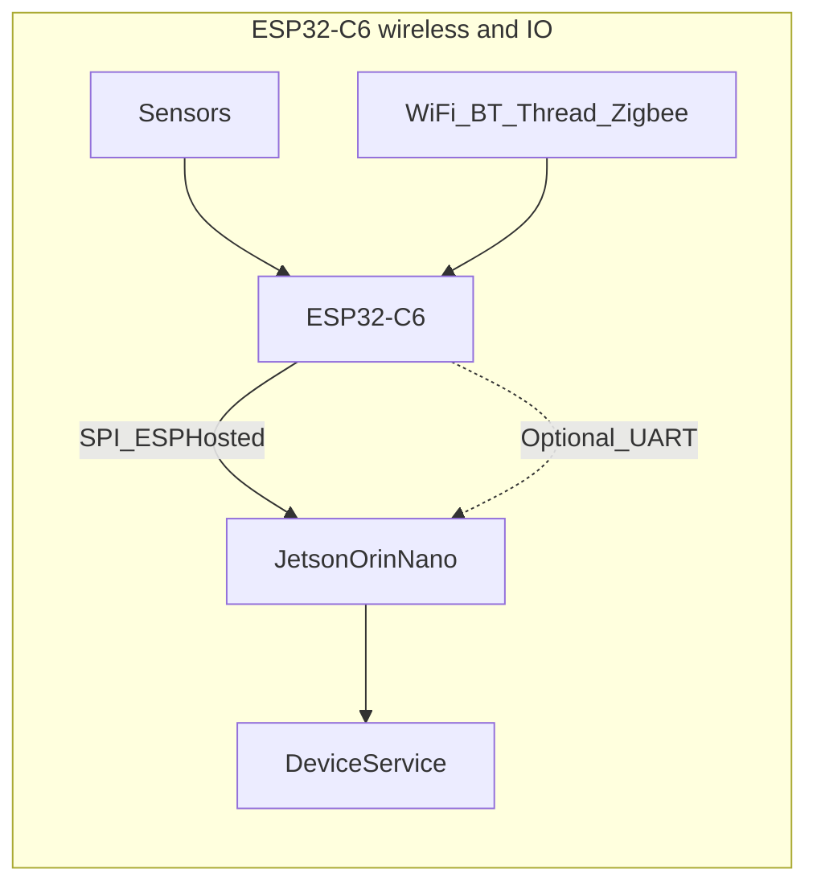

# OrinCraw — Hardware→Inference→UX Capstone (OpenClaw-based)

**OrinCraw** is the **project and product name** for this Phase 4 capstone: an always-on **local AI assistant box** built on **Jetson Orin Nano 8GB**, orchestrated by [**OpenClaw**](https://github.com/openclaw/openclaw), with **ClawBox-inspired** goals (offline-first voice, smart home, optional BYOK cloud). The roadmap folder is still named `5. OpenClaw Assistant Box` for repository structure; use **OrinCraw** in hostname, UI, OTA channel, and documentation.

Build OrinCraw end-to-end, optimized across:
- **Hardware-level**: power, thermals, storage, audio I/O, connectivity, serviceability
- **System-level**: secure boot, reliable OTA, observability, deterministic latency
- **Inference-level**: quantization, TensorRT/ONNX Runtime, batching, KV-cache, streaming, memory reuse
- **UX-level**: fast wake, low-latency voice, offline-first privacy, “it just works” setup

The target is **better usability than Alexa Pro-style assistants** by being:
- Offline-first (privacy by default)
- Faster perceived response (streaming + local)
- More reliable (no cloud dependency, robust OTA + rollback)
- More capable for power users (local skills/plugins, scripting, device control)

---

## 1) Product identity and naming

| Use | Example |
|-----|---------|
| **Product / project name** | **OrinCraw** |
| **Hostname** | `orincraw` or `orincraw-<room>` |
| **Local URL (mDNS)** | `http://orincraw.local` (or serial-suffixed variant for multiple units) |
| **OTA / update channel id** | e.g. `orincraw-stable`, `orincraw-beta` |
| **Stack orchestration (template)** | See [orincraw-deploy/docker-compose.yml](orincraw-deploy/docker-compose.yml) |

**Brainstorm names not chosen:** ClawForge, OrinOwl, EdgeManta, LocalLynx, WhisperHarbor, SentinelNest, NimbleDLA, HushPilot, QuartzClaw, KestrelBox.

### Product visualization (AI image prompts)

*Reference render / concept art only—not mechanical drawings or a frozen BOM.*

#### Exploded / cutaway (illustrative)

*Storytelling visualization only—not an approved assembly, stack-up, or thermal model.*

#### Retail packaging concept

*Packaging mock-up for marketing; final graphics and regulatory markings TBD.*

#### CMF study (color, material, finish)

*CMF exploration; satellite / accessory units are optional product ideas, not committed SKUs.*

#### Lifestyle context

*Lifestyle render for scale and ambience; proportions are approximate.*

Use these for pitch decks, README hero art, or CMF exploration. **Do not treat renders as engineering truth**—they are mood and proportion references only.

**Master prompt (copy-paste):**

> Premium smart-home AI assistant hardware, compact voice-first device, **no screen**. Cylindrical or softly rounded tower (~130 mm tall), matte dark graphite polycarbonate with a thin brushed aluminum accent ring. **Top:** minimal LED status ring, soft blue pulse (listening). **Front:** acoustic fabric grille, full-range speaker, small recessed **hardware mute** on the side. **Base:** subtle ventilation slots, rubber foot ring. **Rear:** USB-C PD, Gigabit Ethernet, clean industrial design. Photorealistic product photo, studio softbox, white seamless background, soft shadow, three-quarter hero angle, 85 mm lens look, shallow DOF, high detail, **no text, no logos, no people**.

**Negative prompt (when the tool supports it):** screen, display, laptop, phone, messy cables, cartoon, illustration, low quality, blurry, deformed, garish RGB gamer aesthetic, watermark, readable text, brand logos.

**Tool hints**
- **Midjourney:** `--ar 4:5` or `--ar 16:9` for hero; add `--style raw` for straighter product look; iterate with `--sref` on a seed you like.
- **DALL·E / ChatGPT image:** ask for “studio product photography, single object, white background” and paste the master paragraph.
- **Flux / SDXL:** use the master prompt + negative; CFG medium; fix seed for A/B on grille texture and LED diffusion.

**Shot variants (short add-ons)**
- **Lifestyle:** same device on walnut side table, warm evening light, living room bokeh, still no screen.
- **CMF study:** three colorways in one frame (graphite, warm gray fabric, silver accent)—orthographic front/side/top layout sheet.
- **Packaging:** minimal black retail box beside device, embossed line only (no readable words).
- **Exploded (stylized):** ghost layers suggesting speaker, PCB edge, heatsink fins—keep subtle, not a full mechanical drawing.

---

## 2) Product definition (what “better” means)

### User promises (non-negotiables)
- **Always ready**: wake word works within seconds of power-on; no “boot lag” surprises.
- **Instant feedback**: audible/visual acknowledgement within ~150–250ms of wake.
- **Offline-first**: core voice + local chat + local automations work without internet.
- **Private by default**: no audio leaves the device unless user explicitly enables a cloud connector.
- **Predictable**: stable latency (p99) under load; graceful degradation when hot or memory-tight.

### Primary use-cases
- Voice assistant (wake word, STT, NLU, TTS, tools)
- Browser automation (“Open this site, login, click X”)
- Home control (MQTT/Home Assistant)
- Local RAG over personal docs (optional)

### Offline-first product requirements & acceptance criteria
OrinCraw ships **offline-first**: core voice and automation work **without internet** unless the user enables optional cloud connectors.

**Must work with WAN unavailable** (no upstream internet; LAN may still exist):
- Wake word → LED/audio ack → streaming STT → **local** LLM + tools → streaming TTS
- Web UI reachable on the LAN for status, smart-home control, and settings (after initial onboarding)
- Local skills: MQTT/Home Assistant, browser automation to **LAN** targets, RAG over **on-device** `/data` storage
- OTA: if no route to update server, show explicit **“update unavailable”** (LED + UI); no silent failure

**Privacy (default)**
- No microphone audio and no transcribed text leave the device unless a **cloud connector** is explicitly enabled
- No vendor cloud logging by default; any future diagnostics upload must be **opt-in** and documented

**When optional BYOK cloud is enabled** (see §4)
- UI indicates **local vs cloud** for the active policy or last reply where practical
- If the cloud API is unreachable, **fall back** to local model or a clear spoken/UI error—no indefinite hang

**Acceptance checklist (QA)**
- [ ] Soak ≥24 h with WAN down: no unbounded memory growth / OOM in the voice pipeline
- [ ] WAN drops mid-session: recover within one user turn (retry or explicit prompt)
- [ ] Factory reset: returns to **offline-first** defaults; cloud keys and connectors **wiped**

---

## 3) Hardware platform (recommended + alternatives)

### Product requirement: custom PCB for ultimate product-grade
The **ultimate shippable product** is **not** a stock dev kit in a box. It requires a **custom PCB** (carrier / product board) that is **purpose-built** for this assistant:

- **Why custom PCB**: Dev kits include **unnecessary** parts (extra connectors, debug headers, full-size carriers, features you do not ship) and **miss** product needs (tight integration of PD, audio codec, ESP32-C6 + antenna, LED ring drivers, battery BMS, mechanical fit, EMI/thermal). A custom board **removes waste**, **adds only what the BOM requires**, and reaches **product-grade** reliability, cost, and certification readiness.
- **BOM discipline**: For each net and component, ask: **required for the defined UX?** If not, **omit**. If yes but missing on dev kit, **add** (e.g. dedicated SPI for ESP-Hosted, PMIC for battery path, codec for I2S mics, status LED chain, factory test points).
- **Compute**: Use a **Jetson compute module** (e.g. Orin Nano 8GB module) on **your** carrier—not the dev kit PCB—for the final product. Software is developed and proven on the dev kit first, then **ported** to the custom carrier (**document the JetPack revision** per release; re-validate pinmux, power, and drivers after each JetPack migration).
- **Deliverables**: Schematics, PCB layout, stackup, fab/assembly outputs (Gerber, pick-and-place, BOM), DFM/DFA notes, and **bring-up** checklist for the custom board (see §10 Hardware deliverables).

### Recommended baseline (bring-up and software development)
Use the **Orin Nano 8GB Developer Kit** only as the **reference for software bring-up** and pipeline development; migrate to the **custom module carrier** for the ultimate product.

- **Compute (bring-up)**: NVIDIA Jetson Orin Nano 8GB Dev Kit — **JetPack / L4T strategy** (pinned versions, upgrades): see **JetPack / L4T version strategy** below.
- **Storage**: **512GB NVMe** (default; boot + rootfs + models + logs/OTA staging). Optional **eMMC** for fixed-BOM or rugged SKUs where removable storage is undesirable.
- **Connectivity**: **Gigabit Ethernet** on Jetson only (no on-board WiFi 6 / BT 5.x). **WiFi and Bluetooth/BLE** to Linux use **[ESP-Hosted](https://github.com/espressif/esp-hosted)** over **SPI** between Jetson and **ESP32-C6** (see below). **Thread**, **Zigbee**, and **Matter** remain on the C6 (coexistence with ESP-Hosted firmware per Espressif docs). **Reliable WiFi** is a product requirement—SPI + ESP-Hosted-NG gives a proper Linux wireless interface (`cfg80211`, `wpa_supplicant`, NetworkManager).
- **Audio**: 2-mic array + far-field DSP (I2S) + speaker (see “Speaker design” below)
- **Power**: USB-C PD input (target 15W typical, 25W peak); **own battery** option for backup/portable (see “Battery design” below)
- **Enclosure**: thermally designed case with dedicated heat sink and airflow (see “Heat sink design” below)

### JetPack / L4T version strategy
OrinCraw tracks NVIDIA releases in **phases** so early bring-up can start on a stable older stack and the product line moves forward deliberately.

| Phase | JetPack target | Role |
|-------|----------------|------|
| **1 — Initial bring-up** | **5.1.2** | First flash, kernel, and baseline validation (audio, NVMe, Ethernet, early inference experiments). Pin **CUDA / cuDNN / TensorRT** to NVIDIA’s matrix for **5.1.2**. |
| **2 — Production-aligned** | **6.2.1** | Planned upgrade for the main software line: rebuild **TensorRT/ONNX** engines on-device, rebuild **ESP-Hosted** host driver for the new **L4T kernel**, rebase **containers** to matching L4T base images, re-run OTA + rollback tests. |
| **3 — Future** | **7.x** | Adopt **when NVIDIA officially supports** the OrinCraw **target module + carrier** on JetPack 7. Treat as a **major migration** (same rigor as 5 → 6: full regression, optional forced OTA channel). |

**Rules**
- Record the **active JetPack** in release notes, factory config, and `/health` (or equivalent).
- Never load kernel modules or DKMS builds (e.g. ESP-Hosted) built for one JetPack onto another without rebuilding.
- After each jump, re-run the **benchmark checklist** (§10) and **risk review** (§9), especially **R2** (ESP-Hosted / kernel).

### Hardware phases (dev kit → custom PCB)
- **Phase 1 — Software on dev kit**: Validate STT/LLM/TTS, OpenClaw, ESP-Hosted (SPI to C6 on a **breakout or interposer** if needed), audio pipeline, and OTA on the **Orin Nano Dev Kit**.
- **Phase 2 — Ultimate product (required)**: **Custom carrier PCB** for **Jetson Orin Nano (or Orin NX) compute module** with only necessary circuits: module socket, **USB-C PD** controller and power path, **Ethernet PHY**, **eMMC and/or NVMe** (per product SKU), **I2S audio codec** + mic array interface + speaker amp, **ESP32-C6** (SPI for ESP-Hosted + optional UART for LED/buttons), **LED drivers** (ring or chain), **buttons/mute**, optional **battery + BMS**, **test points**, **ESD/EMI** per certification plan. **Remove** dev-kit-only blocks (unused USB stacks, debug, duplicate power) from the product BOM.
- **Optional SKU**: Second PCB revision or BOM variant for **Orin NX 16GB** if you need more unified memory for a larger local model—same mechanical envelope where possible.

### Key hardware design choices (what you optimize)
- **Custom PCB vs dev kit**: Final product ships on **custom PCB**; dev kit is for **development only**. Route **ESP-Hosted SPI** per Espressif **length/matching** guidelines; keep **RF** (C6 antenna) and **audio** **analog** sections clean of noisy digital return paths.
- **Storage (NVMe vs eMMC)**: Use **512GB NVMe as the default** for OrinCraw so boot, rootfs, models, logs, and OTA staging share a fast, high-endurance SSD. Use **eMMC** where you need soldered-down storage (rugged or tamper-resistant SKU). Size models and logs so typical deployments stay well within rated drive endurance.
- **Audio I/O**: use I2S + codec (lower latency, better SNR) instead of USB audio dongles.
- **Thermals**: design for **sustained** performance (avoid thermal throttling that ruins UX).
- **Power integrity**: avoid brownouts during peak GPU load + speaker output.
- **Physical UX**: hardware mute switch (mic cut), status LED ring, single “action” button.
- **Own battery**: Optional **own battery design** for backup (UPS) or portable use; USB-C PD charging, BMS protection, power-path logic (see “Battery design” below).
- **ESP32-C6 for wireless + IoT**: Use **ESP32-C6** (not M.2 WiFi on Jetson) for WiFi + BT/BLE to Linux via **[ESP-Hosted](https://github.com/espressif/esp-hosted)** on **SPI**; same chip also targets Thread, Zigbee, **Matter**, sensors, LED ring, and optional wake-path. Validate **coexistence** of ESP-Hosted (WiFi/BT) with Thread/Zigbee/Matter stacks using Espressif documentation and chip capacity.

### ESP32-C6 (wireless + I/O co-processor)
- **Chip**: ESP32-C6 module on carrier/shield; 2.4 GHz WiFi (802.11 b/g/n/ax per ESP-Hosted), Bluetooth/BLE; Thread, Zigbee for smart-home. **SPI** bus to Jetson for **ESP-Hosted** (dedicated pins per Espressif wiring guide); 3.3V; shared ground. Optional **second UART** (or I2C) for simple **DeviceService** traffic (LED/buttons) if you keep network off that link.

### ESP-Hosted on SPI (Jetson + ESP32-C6)
Use **[ESP-Hosted](https://github.com/espressif/esp-hosted)** so Linux on Jetson gets a **standard wireless stack** instead of rolling your own IP bridge over a custom serial protocol.

- **Recommended variant for Jetson (L4T / Ubuntu)**: **ESP-Hosted-NG** — native **802.11** device, configure with **`cfg80211`**, **`wpa_supplicant`**, and **NetworkManager**; Bluetooth via **HCI**. Matches how you would use an M.2 WiFi card, but the radio lives on the C6.
- **Alternative**: **ESP-Hosted-FG** — RPC/protobuf control and **802.3-style** interface; use if you need custom WiFi APIs or shared-IP models (see [variant comparison](https://github.com/espressif/esp-hosted) in the repo).
- **Physical interface**: **SPI** between Jetson and C6 (Espressif documents pinout, mode, and clock limits). Build the **host driver** for your **Jetson kernel** (L4T); flash the matching **slave firmware** on the C6 from the same ESP-Hosted release.
- **Supported chips**: ESP-Hosted supports **ESP32-C6** (among others); pin your project to a **tested release** (e.g. ESP-Hosted-NG tags) and re-verify after JetPack upgrades.
- **Throughput**: Use Espressif’s **throughput benchmarks** for SPI; expect **much better** than UART-only bridging.
- **Coexistence**: Running **Thread / Zigbee / Matter** on the same C6 alongside ESP-Hosted may require a **combined firmware** strategy and vendor guidance—plan integration test early.

**Jetson ↔ ESP32-C6: non-WiFi protocol (minimal sketch)** — for LED, buttons, sensors, **separate** from ESP-Hosted’s SPI (e.g. second UART or I2C) so you do not mix control frames with the WiFi driver:

- **Jetson → ESP32-C6**: `{"cmd":"led","state":"listening"}`; `{"cmd":"led","state":"off"}` (examples). WiFi **join/scan** uses **Linux tools** (`nmcli`, `wpa_supplicant`), not ad-hoc JSON on SPI.
- **ESP32-C6 → Jetson**: `{"evt":"button",...}`; `{"evt":"wake"}`; `{"evt":"motion"}`; `{"evt":"battery",...}`. Optional: RSSI/events for UX if not read from `iw`/`NetworkManager`.

### WiFi reliability (important)
**Reliable WiFi** matters for OTA, optional cloud APIs, setup, and Matter-over-WiFi. Treat it as a first-class requirement, not an afterthought.

- **Bridge to Jetson**: Use **SPI + ESP-Hosted-NG** as the primary path so Linux uses a **real WiFi interface** with kernel/driver support; avoid relying on UART for IP traffic.
- **RF and antenna**: Use a **certified module** with a **proper antenna** (PCB or external); keep antenna away from metal enclosure, battery, and heat sink; follow module vendor layout guidelines. Weak RF causes drops that look like “software bugs.”
- **Firmware**: Implement **auto-reconnect** with backoff, **keep-alive** / ping to AP or gateway, **WiFi power-save** tuning (avoid aggressive sleep that drops MQTT/Matter), and **roaming** behavior if you support mesh APs. Log disconnect reasons for field debug.
- **Ethernet fallback**: When **Gigabit Ethernet** is plugged in, prefer it for heavy traffic (OTA, large downloads) and keep WiFi for convenience or IoT; optionally **fail over** voice-critical signaling if WiFi drops but Ethernet is up.
- **Monitoring and UX**: With ESP-Hosted-NG, read **RSSI** / link state from **`iw`**, **NetworkManager**, or **`/sys/class/net/...`** for `/health`; extend the **LED state table** for “weak WiFi” or “reconnecting” if useful. Voice prompt optional: “WiFi connection lost” when appropriate.
- **Optional upgrade path**: If WiFi must match **laptop-grade** reliability and speed, add **M.2 E-key or USB WiFi on the Jetson** for primary WLAN and reserve ESP32-C6 for **Thread/Zigbee/Matter/BLE** only (higher BOM, best WiFi QoS).

### Speaker design (Alexa-style)
Design the **speaker subsystem** to product-grade level, similar to Alexa, Google Home, or similar voice assistants.

- **Driver**: Full-range driver (typical for compact assistants) or woofer + tweeter if targeting deeper bass; match impedance to amplifier (e.g. 4 Ω or 8 Ω); power handling sufficient for room-filling voice (e.g. 3–10 W RMS).
- **Enclosure**: Sealed or ported; choose internal volume and damping to control resonance and extend low-end where needed; avoid buzzes and rattles; rigid construction (plastic or metal) with internal bracing if large.
- **Placement and directivity**: Decide **360° omnidirectional** (top or side ring, like Echo) vs **directional** (front-facing); top-firing or downward-firing with reflector; ensure even coverage for “assistant from anywhere in the room.”
- **SPL and frequency response**: Target clear **voice band** (300 Hz–3.4 kHz) with adequate headroom; typical max SPL 80–85 dB at 1 m for home use; avoid harsh peaks in the 2–4 kHz range.
- **Echo cancellation**: Place **mic array** relative to the speaker so that acoustic path and mechanical isolation minimize feedback; use software AEC (acoustic echo cancellation) in the pipeline; avoid mic and speaker on the same rigid surface without isolation.
- **Amplifier**: Class-D amp driven from I2S (or DAC + amp); low latency path from TTS to speaker; volume control (hardware or software) with no clipping at max.
- **Mechanical**: Grille (acoustically transparent), vibration isolation between driver and enclosure/carrier; cable routing away from sensitive analog or mic traces.

### Heat sink design (sustained performance)
Design the **heat sink and thermal path** so the Orin Nano sustains **15W typical** and **25W peak** without thermal throttling (target: no clock drop during a 30-minute stress test).

- **Thermal budget**: Orin Nano 8GB TDP 7–25W; target **junction < 80°C** under sustained load (e.g. 15W); margin for ambient up to 35°C.
- **Heat sink**: Adequate **fin area** and **orientation** (vertical fins with chimney flow, or horizontal with side vents); **passive** for 7–10W or **active** (small 5V fan) for 15–25W; thermal resistance θ_JA or θ_JC target (e.g. &lt; 3°C/W from junction to ambient with fan).
- **Thermal interface**: Quality **TIM** (thermal paste or pad) between SoC and heatsink; **contact pressure** even and sufficient (mounting screws or clips per NVIDIA spec); no air gaps.
- **Enclosure**: **Airflow path** clear (inlet low, outlet high for chimney; or side-to-side); **no hot spots** (avoid trapping heat near PCB or battery); optional **thermal pad** from heatsink to metal case for extra dissipation.
- **Acceptance**: Run **30-minute inference stress test** (e.g. continuous LLM or STT); log CPU/GPU clocks and temperatures; **no throttle** (clocks stable), temps within target.

### Battery design (own)
Design an **own/custom battery** for backup (UPS when AC fails) or portable operation.

- **Role**: **Backup/UPS** (device stays on when power drops) and/or **portable** (use without wall power). Choose capacity to match target runtime at 15W typical (e.g. 1–2 h or more).
- **Capacity and runtime**: Size pack (Wh) from load: e.g. 15W typical → 30 Wh for ~2 h, 60 Wh for ~4 h; account for efficiency and margin. Document a **capacity vs runtime** table in the project.
- **Charging**: **USB-C PD** input (15–25W); charge circuit (buck/boost or dedicated charger IC) with **CC/CV** and cell count match (e.g. 2S or 3S Li-ion). No charging when on battery-only (AC absent).
- **Protection**: **BMS** or protection circuit: overcharge, overdischarge, overcurrent, short-circuit, and **thermal** (NTC); safe shutdown or limit when out of range.
- **Power path**: **AC present** → USB-C PD powers device and charges battery; **AC off** → device runs from battery via boost (or direct if voltage match). Prioritize “no brownout” during switchover.
- **Integration**: Cell choice (Li-ion pouch or 18650), mechanical fit in enclosure, **venting** path if required by safety; keep battery away from heat sink. **Safety**: follow local regulations (UN38.3, CE, etc.) for integration and shipping.
- **Low-power mode on battery** (optional): When on battery, optional "low-power mode": reduce GPU max frequency or pause heavy inference after idle, dim LED, optionally switch to a smaller/faster model to extend runtime. Make it configurable (web UI or config).

---

## 4) Software stack (clean and compatible)

### OpenClaw as base platform
- **What OpenClaw provides**: Gateway (control plane), multi-channel inbox (WhatsApp, Telegram, Slack, etc.), skills runtime, browser automation, onboarding CLI. Use it as the **orchestrator** for sessions, tools, and channels.
- **What OrinCraw adds**: Local inference (STT, LLM, TTS) as services/tools; DeviceService (LED, buttons, mute, power/thermal); ESP32-C6 for wireless, Matter, and I/O; hardware UX (no screen, light-as-signal).
- **Running OpenClaw on Jetson**: Node ≥22; install via `npm install -g openclaw@latest` or from source (`pnpm build`); run gateway with `openclaw gateway --port 18789`. Use `openclaw onboard --install-daemon` for a persistent service. Config and credentials: `~/.openclaw` and/or `/data/config` when deployed on the box.
- **Dev workflow**: Build and test OpenClaw on a host (macOS/Linux/WSL); deploy the same binary or Docker image to Jetson. Local inference services (STT/LLM/TTS) run on Jetson and are called by OpenClaw as tools or via a small bridge service.

**Getting started checklist (Jetson):** [orincraw-deploy/Getting-started-Jetson.md](orincraw-deploy/Getting-started-Jetson.md)

### End-to-end architecture (OrinCraw)

WiFi/BT to Linux: **ESP-Hosted-NG** on **SPI**; LED/button traffic: optional **second UART or I2C** (§3).

### Optional BYOK cloud AI (Claude / GPT / Gemini)
OrinCraw remains **offline-first**; cloud LLM/API use is **opt-in** via **bring your own key** (BYOK), similar in spirit to ClawBox-style setups.

- **Configuration**: API keys only under `/data/config` or OpenClaw’s secure config with strict permissions (**`0600`**); inject via environment at container runtime—never commit keys or bake them into images
- **Routing policies** (choose one product policy and document it for users):
  1. **Per-session / explicit command** — user selects local vs cloud
  2. **Local default, cloud on request** — cloud only when user asks for a “bigger” or longer task
  3. **Heuristic split** — short/quick on local; complex or long-context on cloud (with safe fallback if cloud fails)
- **UX**: Visible indicator when a reply used a cloud model (badge, footnote, or settings); onboarding warning when enabling cloud
- **Security**: Key rotation from UI; disabling cloud connectors must stop outbound API calls immediately

If **no keys** are configured, behavior is **strictly local**.

### Base OS and packaging
- **OS / JetPack**: Follow **§3 JetPack / L4T version strategy** (start **5.1.2**, upgrade to **6.2.1**, then **7** when officially supported). **Ubuntu rootfs, CUDA, TensorRT, and system libraries** are defined by the **flashed JetPack**—use NVIDIA release notes for the exact versions per line (they differ between 5.1.2 and 6.2.1). Optimize L4T for fast boot and **NVMe** (see “L4T Linux optimization” below).
- **App packaging**: Docker Compose (OTA-friendly), with host-level udev and minimal services. **Template:** [orincraw-deploy/docker-compose.yml](orincraw-deploy/docker-compose.yml) — replace image names/build contexts with your built L4T-compatible images.
- **Data layout** (bind-mount or named volumes on Jetson):
  - `/data/models` (persistent model cache)
  - `/data/skills` (plugins)
  - `/data/logs` (rotated)
  - `/data/config` (device config, secrets, BYOK keys)
- **Observability**: per-service health endpoints where applicable; aggregate on `/health` in a small reverse proxy or gateway sidecar; log rotation under `/data/logs`

### L4T Linux optimization (boot time, storage, memory)
- **Boot time**: Disable or delay unused services; use `systemd` parallelization; trim initramfs and optional rootfs; target minimal time from power-on to “assistant ready.”
- **Disable unused services**: Turn off desktop/GDM if headless; disable unneeded L4T/JetPack daemons (e.g. extra nv* services not required for inference); reduce default network/avahi usage if not needed.
- **Storage-friendly**: Minimize unnecessary writes to NVMe/eMMC (e.g. logs to tmpfs or aggressive rotate; OTA staging with care); consider read-only or mostly-static rootfs with overlay for configs and app data.
- **Memory footprint**: Free RAM for model residency by reducing kernel/CMA carveouts only if safe; avoid unnecessary background processes.
- **Checklist**: Document a concrete list (services to disable, kernel/device-tree options, filesystem mounts) in the project repo or guide.

### Core services (separate processes/containers)
- **Wake word**: low-power always-on (CPU/DSP-friendly)
- **STT**: streaming speech-to-text (GPU-accelerated if available)
- **LLM**: local chat/instructions + tool calling (streaming tokens)
- **TTS**: low-latency voice synthesis
- **Orchestrator**: session manager, routing, permissions, rate limits
- **Tool/Skills runtime**: sandboxed plugins (home automation, browser control, calendar, etc.)
- **UI**: local web UI (setup, device status, logs, updates)

---

## 5) Inference optimization plan (hardware→runtime)

### Principles that improve real UX (not just TOPS)
- **Minimize time-to-first-token (TTFT)**: keep model warm, pin memory, reuse KV cache if safe.
- **Stream everything**: partial STT results, streaming LLM tokens, incremental TTS.
- **Avoid copies**: prefer zero-copy audio buffers (shared memory), reuse GPU buffers.
- **Deterministic scheduling**: isolate CPU cores for audio + orchestrator, cap background tasks.

### Jetson memory architecture vs “normal” small LLM setups
Jetson Orin Nano is **not** the same memory model as a typical laptop or small server, so **off-the-shelf “small LLM” guides** (tuned for x86 + discrete GPU, or CPU-only with lots of system RAM) are **not automatically optimal** here.

- **Unified memory (UMA)**: CPU and GPU share **one** **LPDDR** pool (e.g. 8 GB total). There is **no separate VRAM**. Weights, KV cache, CUDA workspaces, STT/TTS, the OS, Docker, and OpenClaw **all compete for the same physical RAM**. A config that “fits” on paper for 8 GB on a PC often **fails on Jetson** once the full stack is running.
- **Carveouts and reserved memory**: L4T reserves regions for **CMA** (GPU, multimedia), firmware, and subsystems. Usable free memory for models is **less** than `8 GB` in `free -h`. Treat **measured** `tegrastats` / `/proc/meminfo` under load as the truth, not datasheet RAM alone.
- **Why “normal small LLM” isn’t optimized by default**:
  - Recipes assume **PCIe GPUs** (explicit H2D/D2H) or **CPU-only** with no unified allocator pressure.
  - Default **batch sizes**, **context lengths**, and **KV cache** growth can spike unified memory and trigger **OOM**, **swap thrashing** on NVMe (or severe slowdown), or **kills** of unrelated services.
  - **GGUF + llama.cpp**-style stacks can work but must be sized for **total** RAM including GPU mapping; prefer paths that use **TensorRT / ONNX Runtime with CUDA** on Jetson where they match your model and give predictable memory.
- **What to do on this project**:
  - **Profile end-to-end** with STT + LLM + TTS + Gateway running; set **max context** and **cache** limits explicitly.
  - **Build engines on-device** (TensorRT/ONNX) for the **actual** JetPack/L4T version; do not assume a model tuned for RTX desktop behaves the same on Orin.
  - **One resident LLM** at a time; **load-once**; avoid keeping multiple large weights mapped.
  - Revisit **L4T optimization** (services, CMA) only with measurement—see roadmap deep dive: [**Orin Nano Memory Architecture**](../1.%20Nvidia%20Jetson%20Platform/Orin-Nano-Memory-Architecture/Guide.md).

### Concrete optimization checklist
- **Quantization strategy**
  - Small/medium LLM: INT4/INT8 where supported; validate quality on your skill tasks.
  - STT/TTS: FP16 often best tradeoff; consider INT8 for stable latency if supported.
- **Runtime choice (pick per workload)**
  - **TensorRT**: best for supported CNN/transformer subgraphs; build engines on-device.
  - **ONNX Runtime (CUDA/TensorRT EP)**: for portability + easier integration.
  - **DLA offload**: use DLA for supported layers to reduce GPU contention (and power), with GPU fallback.
- **Memory**
  - **Unified memory**: Remember CPU+GPU share LPDDR; budget KV cache, CUDA, and system together (see “Jetson memory architecture” above).
  - Pre-allocate and reuse buffers (avoid allocator jitter).
  - On **NVMe storage**: load model once at boot or on first use and keep it resident in RAM; avoid unnecessary re-reads from disk during normal inference. Pre-build TensorRT/ONNX engines on the image to skip first-boot compile and reduce disk churn.
- **Profiling**
  - `trtexec` for baseline throughput/latency
  - Nsight Systems for end-to-end (audio→STT→LLM→TTS)
  - `tegrastats` for thermal/power + throttling detection

### Model and disk optimization for 512GB NVMe (default setup)
- **Single default stack (baseline)**: One small/medium LLM (e.g. Q4 quantized), one STT, one TTS that comfortably fit in **512GB NVMe** alongside logs and OTA staging.
- **Quantization**: Prefer INT4/INT8 for LLM and INT8/FP16 for STT/TTS to reduce model size and cold-start time from NVMe.
- **Load-once, keep resident**: Load the active model into RAM at startup or first use; avoid repeated loads during normal inference so disk speed has minimal impact on latency.
- **Pre-built engines**: Ship or build TensorRT/ONNX engines once (e.g. on first OTA or factory image) so the device does not compile on first boot; this improves UX and reduces write amplification.
- **Multiple models**: Use remaining NVMe capacity for alternate models or RAG indices, but document how many configurations you support within endurance and backup constraints.

### Recommended default models (Orin Nano 8GB)
Concrete starting points for the single default stack (fit 512GB NVMe with room for logs/OTA, load-once resident). **Pick and validate under full unified-memory load** (see “Jetson memory architecture” above)—a model that fits in isolation may OOM with STT+TTS+OS+Docker.

- **LLM**: Phi-3 mini (Q4), Qwen2.5-7B (Q4), or TinyLlama (lowest footprint); choose by latency vs quality on 8GB **unified** RAM with the whole pipeline running. Export to ONNX or use GGUF; build TensorRT/ONNX Runtime engines **on the Jetson**.
- **STT**: Whisper small (or distilled) with streaming; alternative: faster/smaller model for lower latency. Prefer ONNX or TensorRT for GPU.
- **TTS**: Piper (local, low latency) or Coqui TTS; trade quality vs speed. Ensure first-audio-chunk latency is under the voice budget.

Document format (ONNX/GGUF/etc.) and where to obtain or build engines in the project repo.

### Orin Nano 8GB: service memory & power budget (planning)
**8 GB unified memory** is shared by L4T, Docker, OpenClaw, CUDA, and every inference service. Treat the table as **starting budgets**; validate under **full stack** with `tegrastats`, `/proc/meminfo`, and the memory deep dive: [**Orin Nano Memory Architecture**](../1.%20Nvidia%20Jetson%20Platform/Orin-Nano-Memory-Architecture/Guide.md).

| Component | Typical RAM (planning) | Notes |
|-----------|------------------------|--------|
| L4T + baseline daemons | 1–1.5 GB | After trim (§4 L4T optimization) |
| Docker + OpenClaw Gateway | 0.5–1 GB | Node 22 + gateway |
| Wake word | 0.05–0.2 GB | Resident; CPU-light |
| STT | 0.5–1.5 GB | Model + GPU activations |
| LLM (one resident) | 2–4+ GB | Dominates; cap context/KV explicitly |
| TTS | 0.2–0.6 GB | Optimize first-audio latency |
| ESP-Hosted + small daemons | 0.1–0.3 GB | Kernel + side-channel services |
| **Headroom** | ≥ 0.5 GB | Avoid OOM on spikes |

**Power / thermal:** Target **~7–15 W** typical assistant load and **≤25 W** short peaks; heatsink and enclosure must pass the **30-minute stress** acceptance in §3 (no sustained throttle).

### Latency budget (target numbers)
Use these as acceptance criteria for "better than Alexa" perceived speed:

| Stage | Target |
|-------|--------|
| Wake ack (LED + chime) | &lt; 200 ms |
| STT first partial result | &lt; 500 ms |
| LLM time-to-first-token | &lt; 1 s |
| TTS first audio chunk | &lt; 300 ms after first token |
| End-to-end (user stops speaking → first TTS output) | p95 &lt; 2.5 s |

Adjust to your measurements; log p50/p95/p99 in the benchmark report.

---

## 6) UX design (what beats “smart speakers”)

### Default UI: smart-home control (no screen)
The device has **no screen**. Design a **specific, better default UI** for **smart-home control** as the primary experience.

- **Primary control**: **Voice** (wake word + commands) and **web UI** (from phone/tablet at e.g. `http://<device>.local`) for setup, rooms, devices, scenes, automations.
- **Smart-home first**: Default flows: list/control rooms and devices, run scenes, set automations, pair **Matter** and Zigbee/Thread devices. Integrate Home Assistant / MQTT / **Matter**; keep web UI focused for “turn off kitchen,” “run evening scene,” “add device,” and Matter commissioning.
- **Mobile app**: Planned for **later development**; not in initial release. Default is voice + web UI + light signals; mobile app (control, notifications, setup) in a later phase.

### Light-as-signal (intelligent LED design)
Use the **LED ring** (or status LED) as the main **out-of-band signal** so users understand state without a screen.

- **State table**: Idle (soft glow or off), **Listening** (e.g. blue pulse/spin), **Processing** (amber), **Success** (green brief flash), **Error** (red blink or blink count), **Updating/OTA** (alternating pattern), **Muted** (dim or red dot), **Network** (no WiFi = specific pattern). **Distinct patterns** (solid, pulse, spin, blink count) so states are recognizable at a distance.
- **Consistency**: Same pattern = same state; document table in user guide and in software (single source of truth for LED driver).
- **Accessibility**: Prefer pattern + color; keep patterns short and non-distracting when idle.

**LED state reference table** (single source of truth for firmware and DeviceService):

| State     | Color | Pattern        | When |
|-----------|-------|----------------|------|
| Idle      | Off/dim | Solid       | Ready, no activity |
| Listening | Blue  | Pulse          | Wake detected, capturing |
| Processing | Amber | Spin         | STT/LLM/TTS running |
| Success   | Green | 1 short flash  | Command done |
| Error     | Red   | 2 blinks (or count = code) | Failure |
| Updating  | Amber+Blue | Alternating | OTA in progress |
| Muted     | Red   | Dim solid      | Mic muted |
| Weak WiFi | Amber | Slow pulse     | Low RSSI or reconnecting |
| No network | Red  | Slow blink     | WiFi down |

### Setup UX (no-terminal, under 5 minutes)
- Captive portal or local web UI at `http://orincraw.local` (or your chosen hostname)—style mDNS name
- WiFi onboarding + optional Ethernet-first flow
- “Voice calibration” wizard (mic gain, noise profile, wake word sensitivity)
- One-click update and rollback

### Interaction UX
- Wake confirmation (LED ring + short chime)
- Barge-in support (user can interrupt TTS)
- **Accessibility (voice)**: Optional slower or higher-contrast TTS; repeat-last-reply on request (e.g. "repeat" or action button).
- Clear privacy controls:
  - Hardware mic mute switch
  - UI toggles for cloud connectors
  - Per-skill permission prompts (first use)

### Reliability UX
- If hot: “Performance mode reduced” with ETA + optional “silent mode”
- If offline: no errors—just local mode; queue cloud actions until online (if enabled)

### Failure modes and diagnostics
- **Component failure** (STT/LLM/TTS timeout or crash): Retry once, then Error LED + optional voice "I'm having trouble"; log for diagnostics.
- **ESP32-C6 disconnect**: If **ESP-Hosted SPI** drops, WiFi/BT is lost until the driver/firmware recover—surface **No network** / **Weak WiFi** LED and log; Ethernet still works if plugged. If only the **side-channel** (LED/button UART) drops, keep WiFi up and recover the control link.
- **Low battery**: LED pattern or voice warning; optional auto low-power mode.
- **OTA failure**: Rollback per OTA strategy; LED indicates "update failed."
- **Web UI health**: Expose a simple **health page** (e.g. `/health`) with status of Gateway, STT, LLM, TTS, **WiFi interface (ESP-Hosted)**, optional **ESP32 side-channel** (LED/buttons), and battery (if present).

---

## 7) Compatibility goals (what “better compatibility” means)

- **Matter**: **Matter** protocol support as controller/bridge; commissioning and control of Matter devices over Thread and WiFi (via ESP32-C6); expose in default smart-home UI and voice.
- **Home automation**: Home Assistant (REST + MQTT), Zigbee2MQTT optional
- **Messaging**: Telegram/WhatsApp via opt-in connectors
- **Browsers**: Playwright-based automation in container
- **LLM APIs (optional)**: BYOK connectors (Claude/GPT/Gemini) behind a policy gate
- **Model formats**: ONNX as interchange; TensorRT engines built per device

### Compliance and certifications (reference)
If targeting sale or distribution, plan for: **FCC/CE** (RF from ESP32-C6, emissions, safety); **Matter** (CSA certification for controller/bridge); **Battery** (UN38.3, IEC 62133, regional e.g. CE) if shipping with battery; **Safety** (PSU, enclosure, thermal). Document which apply and when to involve test labs.

---

## 8) Security + OTA (production-grade, not hobby)

### Security baseline
- Disable password SSH (keys only), firewall minimal ports
- Least-privilege containers, read-only FS where possible
- Secrets stored in `/data/config` with strict permissions (or TPM if available)
- Signed updates + integrity checks

### OTA strategy
- **Staged update**: Download new image/artifact to a **staging** partition or directory (not the active rootfs); verify **signature** and **integrity** (e.g. SHA256) before any switch.
- **Verify-then-switch**: Run **health checks** after staging (e.g. service starts, basic inference responds) or after booting the new slot; only then **commit** (e.g. set active boot slot or promote staged image). Never switch without verification.
- **Rollback**: **Automatic rollback** if (1) boot fails (e.g. boot counter or watchdog), or (2) post-update health check fails within a short window. Use a **retry counter** and **fallback slot** (A/B) so the device always returns to a known-good image.
- **Channels** (optional): Support **stable** (and optionally **beta**) channel; user selects in web UI or via config.
- **User-visible**: Optional “Update available” indication (LED pattern or voice); **update-in-progress** LED pattern (e.g. OTA state in light-as-signal table); do not power off during apply.
- **Summary**: Download → verify signature/integrity → stage → health check (or boot new slot + health check) → commit or rollback; document the flow and recovery procedure in the project.

---

## 9) Risk analysis (OrinCraw)

Use this as a living **risk register**: review at each milestone (especially before **custom PCB tape-out**, **ESP-Hosted** integration freeze, and **OTA** go-live). Scale *Likelihood* and *Impact* as **L/M/H** (Low / Medium / High) for your program.

### Summary risk register

| ID | Risk | Likelihood | Impact | Mitigation (summary) |
|----|------|------------|--------|----------------------|
| R1 | **Unified memory OOM** — STT + LLM + TTS + Docker + OS exceed 8 GB UMA under real workloads | M–H | H | One resident LLM; hard caps on context/KV; profile with `tegrastats`; staged service start; see §5 |
| R2 | **ESP-Hosted fragility** — host driver / C6 firmware / JetPack kernel mismatch breaks `wlan0` or needs rebuild after L4T update | M | H | Pin **ESP-Hosted + JetPack** versions; CI or doc’d rebuild path; Ethernet fallback; keep SPI layout per Espressif |
| R3 | **Thermal throttle** — sustained inference + enclosure reduces clocks; UX feels “slow” | M | M | Heatsink + airflow per §3; power/clock caps; graceful “reduced performance” UX |
| R4 | **NVMe endurance / I/O behavior** — heavy logs/OTA/model churn reduce SSD life or trigger throttling/filesystem issues | M | M | Log rotation and retention limits; careful OTA staging; journaling FS with tested power-loss behavior; optional battery-backed or “safe shutdown” design; monitor SMART/health where available |
| R5 | **RF coexistence** — WiFi + Thread/Zigbee/Matter on one C6 causes drops or certification issues | M | H | Early **coexistence** testing; antenna/layout discipline §3; firmware split or feature flags if needed |
| R6 | **Custom PCB NRE / spin cost** — schematic or SI errors on module carrier, PD, or audio | M | H | Dev-kit software baseline first (§11 milestones); peer review; bring-up checklist; budget **re-spin** |
| R7 | **Supply chain** — Jetson module, ESP32-C6 module, or PMIC lead times | M | M | Dual-source where possible; early long-lead orders; SKU that tolerates module revision |
| R8 | **Compliance delay** — FCC/CE/Matter/battery certification fails or slips schedule | L–M | H | Pre-scan EMC; keep RF test modes; engage lab early; document intentional radiators §7 |
| R9 | **LAN / device compromise** — weak defaults, exposed services, or stolen `/data/config` (BYOK keys) | M | H | SSH keys, firewall, least-privilege containers §8; encrypt-at-rest if threat model requires; BYOK off by default |
| R10 | **OTA brick** — bad update with failed rollback | L | H | A/B or staged slots, boot counters, signed artifacts, health gate §8; UART-recovery doc |
| R11 | **Upstream churn** — OpenClaw or inference stack API/version breaks your integration | M | M | Pin versions; smoke tests on upgrade; fork only if necessary |
| R12 | **Battery safety** (if shipped) — thermal runaway, shipping restrictions | L–M | H | BMS, cell quality, enclosure venting, UN38.3 / regional rules §3 battery design |
| R13 | **Privacy / trust** — user perception of “always listening” or accidental cloud send | M | M | Hardware mute, clear LED states §6, offline-first defaults §2, explicit BYOK consent §4 |

### Notes

- **Coupled risks**: R1+R3 often appear together (memory pressure + thermal); R2+R5 interact on the same C6 firmware.
- **Residual risk**: After mitigations, record *residual* L/I and any **accepted** risks for ship approval.
- **Owner**: Assign each ID to a named owner and review date in your project tracker.

---

## 10) Deliverables (what you must ship)

### Hardware deliverables
- **Custom PCB package**: schematics, PCB layout (source + release gerbers), stackup, BOM (optimized: **no unnecessary parts**, **all necessary parts** documented), assembly drawing, pick-and-place, **DFM/DFA** checklist, revision history.
- **Module carrier bring-up**: document power sequencing, strap options, first-boot test procedure, and comparison to dev-kit behavior.
- Thermal plan (target sustained mode, no throttle in a 30-minute stress test) **on the shipping mechanical + PCB**
- Audio subsystem plan (mic array placement, echo cancellation strategy) **integrated in enclosure + PCB**

### Software deliverables
- **Compose template**: [orincraw-deploy/docker-compose.yml](orincraw-deploy/docker-compose.yml) (adapt images/builds for your JetPack)
- **Bring-up checklist**: [orincraw-deploy/Getting-started-Jetson.md](orincraw-deploy/Getting-started-Jetson.md)
- On-device setup UI (OrinCraw branding)
- Benchmark report (see checklist below)

### Benchmark & demo checklist (reproducible)
Run on **final** or representative hardware (dev kit or custom PCB), JetPack version pinned, after L4T trim.

**Latency (log p50 / p95 / p99 where applicable)**
- [ ] Wake → LED/chime ack
- [ ] Wake → STT first partial
- [ ] End of user speech → LLM time-to-first-token
- [ ] First token → TTS first audio chunk
- [ ] End-to-end: user stops speaking → first audible answer

**Throughput & quality**
- [ ] Sustained tokens/sec for chosen local LLM under thermal cap
- [ ] STT WER or task accuracy on a fixed test phrase set (your room, fixed mic distance)
- [ ] TTS MOS or subjective checklist (clarity, barge-in)

**Thermals & power**
- [ ] `tegrastats` during 30 min inference stress: clocks stable, junction within target (§3)
- [ ] Idle / typical / peak power (USB-C PD meter or fuel gauge)

**Reliability**
- [ ] OTA: staged update, failed health → rollback
- [ ] WiFi: disconnect/reconnect soak (ESP-Hosted); optional Ethernet failover
- [ ] Offline-first acceptance (§2)

**Demo script (minimum)**
- [ ] “Turn on the lights” (MQTT or Home Assistant)
- [ ] “Summarize this PDF” (local RAG, optional)
- [ ] Browser automation on a **LAN** test page
- [ ] Disconnect WAN; confirm voice + local skills still work
- [ ] If BYOK enabled: show one cloud reply with **visible** “cloud” indicator, then disable and verify no outbound calls

### Demo scenarios
- “Turn on the lights” (MQTT)
- “Summarize this PDF” (local RAG optional)
- “Open website, sign in, do task” (browser automation)
- “Offline mode” demo (unplug network and keep core features working)

---

## 11) Suggested milestone plan (9 milestones)

1. **Bring-up**: **JetPack 5.1.2** + **NVMe** (512GB) + `tegrastats` monitoring; plan **JetPack 6.2.1** upgrade + full regression; adopt **JetPack 7** only when NVIDIA officially supports target hardware
2. **Audio I/O**: microphone + speaker pipeline, echo control baseline
3. **Wake word**: reliable far-field trigger + privacy switch
4. **STT**: streaming transcription (measure latency + WER on your room)
5. **LLM**: streaming local chat + tool calling
6. **TTS**: natural voice + barge-in
7. **Skills**: MQTT + browser automation + optional BYOK cloud connector
8. **OTA + hardening**: signed updates + rollback + attack-surface audit
9. **Custom PCB + product bring-up**: carrier schematic/layout, fab, assembly, module bring-up, regression vs dev-kit software stack, **BOM freeze** for production

**Implementation order**: Bring-up and Audio I/O first; Wake word and STT next; then LLM and TTS; then skills and Matter; OTA and hardening; **custom PCB** can overlap late (layout/fab in parallel with software) but **module bring-up** (milestone 9) must follow a stable software baseline. DeviceService and LED can be stubbed after bring-up so the web UI and ESP32-C6 firmware can be developed in parallel.

