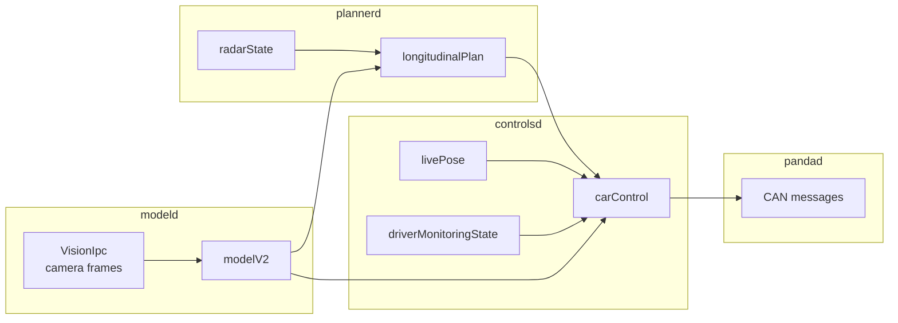
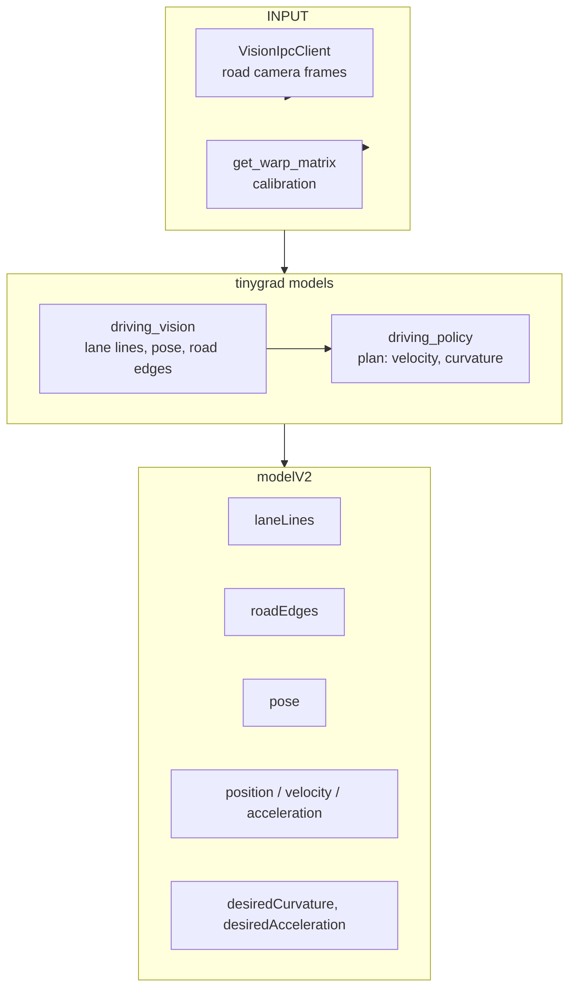
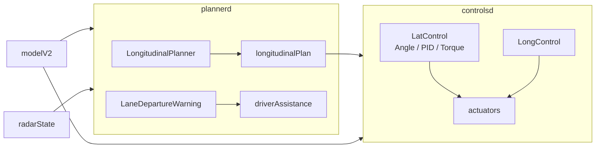
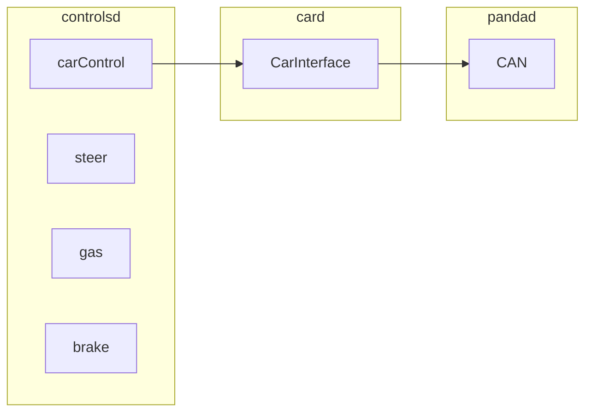

# Openpilot Pipeline — Flow Diagram

End-to-end data flow in **openpilot** (comma.ai), from camera input to CAN actuation. Based on the actual process layout in [`openpilot/`](openpilot/).

---

## High-Level Pipeline

```
┌─────────────┐    ┌─────────────┐    ┌─────────────┐    ┌─────────────┐    ┌─────────────┐
│  camerad    │───▶│   modeld   │───▶│  plannerd   │───▶│ controlsd  │───▶│   pandad    │
│  (camera)   │    │  (tinygrad) │    │  radard     │    │  (lat+long) │    │   (CAN)     │
└─────────────┘    └─────────────┘    └─────────────┘    └─────────────┘    └─────────────┘
                          │                    │
                          │                    └── radarState (lead vehicle)
                          └── modelV2 (lanes, plan, pose)
```

---

## Process-Level Flow (Openpilot)

```mermaid
flowchart TB
    subgraph SENSORS["📷 Sensors"]
        CAM[camerad<br/>Road + driver cameras]
        RADAR[Radar CAN<br/>optional, per car]
        IMU[IMU / GPS<br/>locationd]
    end

    subgraph PERCEPTION["🔍 Perception (modeld)"]
        VISION[driving_vision_tinygrad.pkl]
        POLICY[driving_policy_tinygrad.pkl]
        VISION --> POLICY
    end

    subgraph DM["👁️ Driver Monitoring"]
        DMODEL[dmonitoringmodeld]
        DMON[dmonitoringd]
        DMODEL --> DMON
    end

    subgraph LOCALIZATION["📍 Localization"]
        CALIB[calibrationd]
        LOC[locationd]
        PARAMS[paramsd]
        TORQUE[torqued]
    end

    subgraph PLANNING["📐 Planning"]
        RADARD[radard<br/>lead vehicle tracking]
        PLANNERD[plannerd<br/>LongitudinalPlanner, LDW]
    end

    subgraph CONTROL["🎛️ Control"]
        CONTROLS[controlsd<br/>LatControl + LongControl]
    end

    subgraph ACTUATION["⚙️ Actuation"]
        CARD[card<br/>Car interface]
        PANDAD[pandad<br/>CAN bus]
    end

    CAM --> PERCEPTION
    CAM --> DM
    RADAR --> RADARD
    IMU --> LOCALIZATION

    PERCEPTION --> |modelV2| PLANNERD
    PERCEPTION --> |modelV2| CONTROLS
    LOCALIZATION --> |livePose, liveCalibration| CONTROLS
    RADARD --> |radarState| PLANNERD
    PLANNERD --> |longitudinalPlan| CONTROLS
    DM --> |driverMonitoringState| CONTROLS

    CONTROLS --> |carControl| CARD
    CARD --> PANDAD
```



---

## Message Flow (cereal)



---

## modeld: Perception Detail



**modeld outputs** (from `fill_model_msg`, `parse_model_outputs`):
- Lane lines, road edges, lane line probabilities
- Pose (road transform, device pose)
- Plan (position, velocity, acceleration over time)
- Action (desired curvature, desired acceleration, shouldStop)
- FCW (forward collision) probabilities

---

## plannerd → controlsd



**plannerd** subscribes: `modelV2`, `carState`, `radarState`, `controlsState`, `liveParameters`  
**plannerd** publishes: `longitudinalPlan`, `driverAssistance`

**controlsd** subscribes: `modelV2`, `longitudinalPlan`, `livePose`, `liveCalibration`, `carState`, `driverMonitoringState`  
**controlsd** publishes: `carControl` (actuators)

---

## controlsd → CAN



---

## Openpilot-Specific Notes

| Aspect | Openpilot |
|--------|-----------|
| **Sensors** | Camera(s) primary; radar optional (car-dependent) |
| **Perception** | End-to-end NN (vision + policy) in modeld; no explicit 2D/3D detection |
| **Planning** | Plan from model; plannerd adds longitudinal (ACC, lead follow) and LDW |
| **Control** | LatControl (angle/PID/torque), LongControl; vehicle-specific via opendbc |
| **Inference** | tinygrad (driving_vision, driving_policy, dmonitoring) |
| **Messaging** | cereal (capnp) over IPC |

---

## Process → Source Map

| Process | Path |
|---------|------|
| camerad | `system/camerad/` — [camerad Guide](camerad/Guide.md) |
| modeld | `selfdrive/modeld/modeld.py` |
| dmonitoringmodeld | `selfdrive/modeld/dmonitoringmodeld.py` |
| dmonitoringd | `selfdrive/monitoring/dmonitoringd.py` |
| locationd | `selfdrive/locationd/locationd.py` |
| calibrationd | `selfdrive/locationd/calibrationd.py` |
| radard | `selfdrive/controls/radard.py` |
| plannerd | `selfdrive/controls/plannerd.py` |
| controlsd | `selfdrive/controls/controlsd.py` |
| card | `selfdrive/car/card.py` |
| pandad | `selfdrive/pandad/` |
