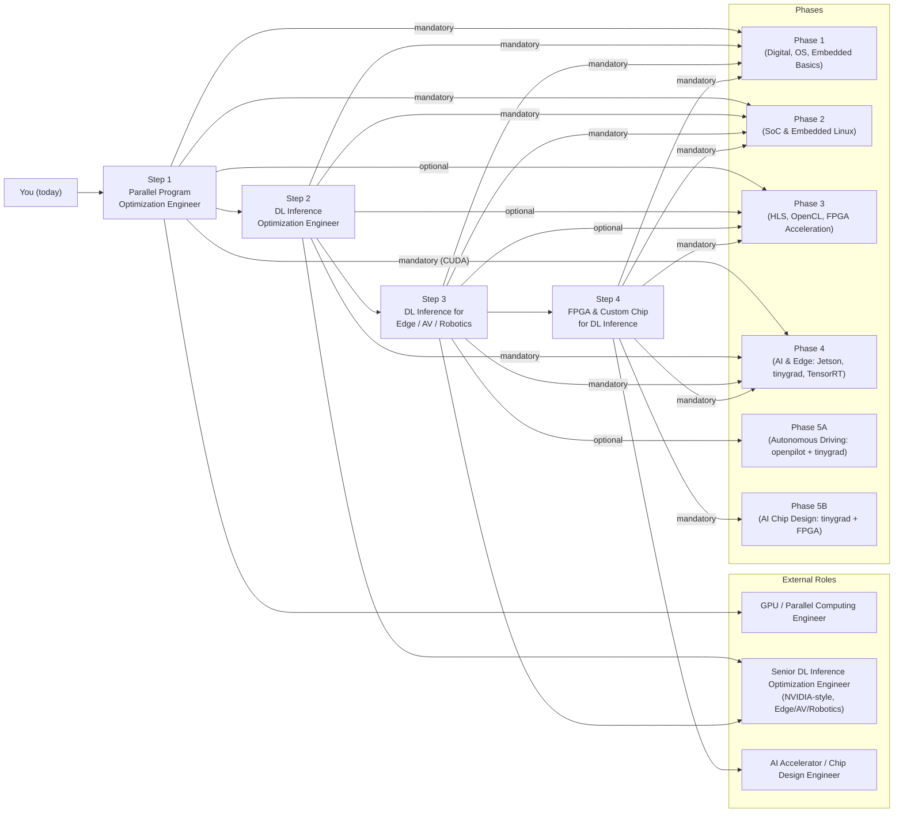

# AI Hardware Engineer Roadmap

**From Kernel-Level Parallel Programming to Custom AI Inference Accelerator Design — powered by NVIDIA GPUs, Jetson, and tinygrad**

*A purpose-oriented, 4-step career progression — backed by a 5-phase hands-on curriculum — that takes you from kernel-level parallel programming to designing custom AI inference accelerators. Reference projects: [tinygrad](https://github.com/tinygrad/tinygrad) (compiler, IR, kernels) and [openpilot](https://github.com/commaai/openpilot) (edge/AV stack using tinygrad).*

---

## The Four Steps

Each step is a **concrete role target**. The [5-phase curriculum](CURRICULUM.md) provides the building blocks; these steps define **where you're going**.

| Step | Role Target | Focus |
|:----:|-------------|-------|
| **1** | **[Parallel Program Optimization Engineer](#step-1-parallel-program-optimization-engineer)** | Kernel-level performance, CUDA/OpenCL, memory hierarchy, heterogeneous compute |
| **2** | **[Deep Learning Inference Optimization Engineer](#step-2-deep-learning-inference-optimization-engineer)** | Model/operator optimization, compilers (TensorRT, TVM, MLIR, tinygrad), quantization |
| **3** | **[DL Inference for Edge / AV / Robotics](#step-3-dl-inference-optimization-for-edge--av--robotics)** | Power- and latency-constrained deployment, full sensor→actuation pipeline, openpilot/Jetson/DRIVE |
| **4** | **[FPGA & Custom Chip for DL Inference](#step-4-master-fpga-for-dl-inference--custom-chip-design)** | Mapping inference to hardware, FPGA prototyping, accelerator architecture, path to ASIC |

**Reference projects** connect all four steps:

| Project | Step 1 | Step 2 | Step 3 | Step 4 |
|---------|--------|--------|--------|--------|
| **[tinygrad](https://github.com/tinygrad/tinygrad)** | Backends, op→kernel | IR, scheduling, BEAM, quantization | Inference on device | Custom backend, workload for accelerator design |
| **[openpilot](https://github.com/commaai/openpilot)** | — | Why inference matters in production | Full edge/AV stack, perception→control | Real workloads for hardware design |

---

## Step 1: Parallel Program Optimization Engineer

**Goal:** Reason about performance at the **kernel and memory-hierarchy level**. You understand how code maps to hardware (GPU, multi-core CPU, SoC), how to interpret profiler output, and how to optimize for occupancy, data movement, and compute utilization.

**What you build toward:**
- Writing and tuning CUDA/OpenCL (or equivalent) kernels
- Understanding warp/SM behavior, memory coalescing, shared memory, streams
- Using tinygrad as a lens: see how high-level ops lower to kernels and how backends (CPU, CUDA, etc.) implement them

**Curriculum mapping:**

| Phase | Topics that feed Step 1 |
|-------|-------------------------|
| **[Phase 1](Phase%201%20-%20Foundational%20Knowledge)** | Digital design (data paths, memory), OS (processes, scheduling, memory management) |
| **[Phase 2](Phase%202%20-%20Xilinx%20and%20Embedded%20Systems)** | SoC and embedded Linux (heterogeneous CPU + accelerators) |
| **[Phase 3](Phase%203%20-%20Advanced%20FPGA%20and%20Acceleration)** *(optional for Step 1)* | OpenCL (kernels, work-groups, heterogeneous compute), HLS (pipelining, dataflow) — useful but not strictly required if you focus on CPU/GPU parallelism first |
| **[Phase 4](Phase%204%20-%20Nvidia%20Jetson%20and%20Edge%20AI)** | Jetson Platform (CUDA, Nsight), Edge AI Optimization (CUDA kernels, TensorRT under the hood) |

**tinygrad / openpilot:**
- **tinygrad:** Study `tinygrad/runtime/` — how each backend (e.g. `ops_cuda.py`) implements `Allocator`, `Compiler`, `Runner`. Trace one op (e.g. `matmul`) from Python to generated kernel. Use BEAM/search to see how tiling affects performance.
- **openpilot:** Not yet central; Step 1 is the foundation that makes "why openpilot uses tinygrad" meaningful later.

**Outcome:** You can read kernel traces, identify memory-bound vs compute-bound code, and optimize parallel programs on GPU/SoC with confidence.

---

## Step 2: Deep Learning Inference Optimization Engineer

**Goal:** Optimize **neural network inference** end-to-end: model and graph structure, operator choice, compilation (fusion, scheduling, codegen), quantization, and deployment toolchains (e.g. TensorRT, ONNX, tinygrad).

**What you build toward:**
- Inspecting model architectures down to the operator level
- Using compiler stacks (TensorRT, Torch-TRT, MLIR-TRT, or tinygrad's own compiler) to improve latency and throughput
- Quantization (INT8, QAT), pruning, and kernel fusion in practice

**Curriculum mapping:**

| Phase | Topics that feed Step 2 |
|-------|--------------------------|
| **[Phase 4](Phase%204%20-%20Nvidia%20Jetson%20and%20Edge%20AI)** | AI Fundamentals (neural nets, backprop, CNNs, tinygrad), Jetson (CUDA, TensorRT), Edge AI Optimization (quantization in tinygrad, TensorRT, tinygrad→ONNX→TensorRT) |
| **[Phase 5](Phase%205%20-%20Advanced%20Topics%20and%20Specialization) – Autonomous Driving** | tinygrad guides (internals, ops, custom backend), BEAM search, pattern matching |

**tinygrad / openpilot:**
- **tinygrad:** Core learning vehicle. Lazy evaluation, linearized IR, scheduling, BEAM for tile selection. Implement or modify ops; add a custom op; understand how the compiler bridges high-level graphs to Step 1 (kernels).
- **openpilot:** Uses tinygrad for inference (e.g. `driving_vision_tinygrad.pkl`, `driving_policy_tinygrad.pkl`). Understanding openpilot's model usage motivates "why inference optimization matters" and what "production on device" means.

**Outcome:** You can take a model, analyze its operator graph and memory footprint, apply quantization/fusion/scheduling, and deploy it with measurable latency/throughput improvements.

---

## Step 3: DL Inference Optimization for Edge / AV / Robotics

**Goal:** Apply inference optimization in **power-limited, latency-sensitive, safety-aware** environments: embedded SoCs (Jetson, DRIVE, Snapdragon), autonomous vehicles, and robots. You understand the full pipeline from sensors to actuation and how inference fits in.

**What you build toward:**
- Deploying and tuning inference on Jetson, DRIVE, or similar edge/AV platforms
- Understanding AV/robotics stacks: perception (camera, radar, fusion), planning, control
- Working within real-time and power budgets; awareness of safety (e.g. ISO 26262, SOTIF) where relevant

**Curriculum mapping:**

| Phase | Topics that feed Step 3 |
|-------|--------------------------|
| **[Phase 4](Phase%204%20-%20Nvidia%20Jetson%20and%20Edge%20AI)** | Jetson, Edge AI Optimization (Jetson + TensorRT), Sensor Fusion, ROS2 |
| **[Phase 5](Phase%205%20-%20Advanced%20Topics%20and%20Specialization) – Autonomous Driving** | openpilot architecture (camerad, modeld, planning, control), flow diagram, tinygrad in openpilot; camerad Guide; BEV/sensor fusion as needed |
| **[Phase 5](Phase%205%20-%20Advanced%20Topics%20and%20Specialization) – Robotics** | ROS2, sensor fusion, motion planning (for robotics-specific deployment) |

**tinygrad / openpilot:**
- **openpilot:** Primary reference. End-to-end flow: camera → ISP → VisionIpc → modeld (tinygrad models) → planning → control → CAN. Study [flow-diagram.md](Phase%205%20-%20Advanced%20Topics%20and%20Specialization/4.%20Autonomous%20Driving/flow-diagram.md), [camerad Guide](Phase%205%20-%20Advanced%20Topics%20and%20Specialization/4.%20Autonomous%20Driving/camerad/Guide.md), and the openpilot codebase.
- **tinygrad:** In openpilot, tinygrad runs on device (e.g. Snapdragon). All of Step 2 (quantization, scheduling, ops) applies here under edge constraints.

**Outcome:** You can own inference optimization for edge/AV/robotics: deploy models on target SoCs, hit latency and power targets, and understand how your work fits into the full autonomous or robotic system.

---

## Step 4: Master FPGA for DL Inference → Custom Chip Design

**Goal:** Move from **software inference optimization** to **hardware**: map inference workloads to FPGAs (HLS, OpenCL, RTL), design accelerator architectures (systolic arrays, dataflow), and understand the path to custom silicon (ASIC/SoC) for DL.

**What you build toward:**
- Profiling and characterizing DL workloads (from tinygrad or real models) to drive hardware design
- Implementing inference on FPGA (e.g. matmul, conv2d, small networks) via HLS or RTL
- Understanding compiler–hardware interface (e.g. TVM, MLIR, or tinygrad backends) and one day contributing to or defining custom accelerator targets

**Curriculum mapping:**

| Phase | Topics that feed Step 4 |
|-------|--------------------------|
| **[Phase 1](Phase%201%20-%20Foundational%20Knowledge)–[2](Phase%202%20-%20Xilinx%20and%20Embedded%20Systems)** | Digital design, Verilog, SoC (PS/PL, embedded Linux) |
| **[Phase 3](Phase%203%20-%20Advanced%20FPGA%20and%20Acceleration)** | Advanced FPGA design, HLS, OpenCL, Computer Vision (workloads to accelerate) |
| **[Phase 4](Phase%204%20-%20Nvidia%20Jetson%20and%20Edge%20AI)** | AI Fundamentals, tinygrad (operator semantics, memory patterns) |
| **[Phase 5](Phase%205%20-%20Advanced%20Topics%20and%20Specialization) – AI Chip Design** | tinygrad as reference ML stack; accelerator architecture (systolic, dataflow); FPGA prototyping; RTL/HLS; path to ASIC |

**tinygrad / openpilot:**
- **tinygrad:** Reference for "what hardware must do." Study operator semantics (conv2d, matmul, attention), graph and memory patterns. Implement a **custom tinygrad backend** (e.g. for an FPGA or simulator) to solidify the software–hardware boundary. AI Chip Design guide: "Implement a Custom tinygrad Backend," "Map a tinygrad Model to Your Accelerator."
- **openpilot:** Supplies real workloads (vision, policy) that you can profile and use to justify accelerator design choices (e.g. which ops to harden in silicon).

**Outcome:** You can characterize DL inference workloads, design and implement FPGA accelerators for them, and understand how this extends to custom-chip design for AI.

---

## NVIDIA-Style Skill Coverage

This roadmap is explicitly designed so that, by the time you reach **Step 3 (DL inference for edge / AV / robotics)** and optionally **Step 4 (FPGA/custom chip)**, you can cover the skills expected for a **Senior Deep Learning Inference Optimization Engineer** (e.g., NVIDIA AV/robotics roles).

### Deep Learning Architectures & Inference

- **Architectures:** Transformers, attention variants, ViT/vision encoders, multi-modal VLMs, diffusion/flow-matching models, state space models (SSMs), hybrid SSM–Transformer backbones, multi-camera tokenizers.
  - **Where you build this:**
    - [Phase 4](Phase%204%20-%20Nvidia%20Jetson%20and%20Edge%20AI) AI Fundamentals (CNNs, attention, sequence models) → Step 2.
    - [Phase 5](Phase%205%20-%20Advanced%20Topics%20and%20Specialization) Autonomous Driving + tinygrad guides (vision backbones, BEV/VLM-style architectures, multi-camera perception) → Steps 2–3.
- **Model-level reasoning (down to operator/kernel):**
  - Step 2 via tinygrad internals (ops → IR → kernels, BEAM, scheduling) and TensorRT pipeline.
  - Step 1 via CUDA/OpenCL and tinygrad backends (how each op becomes a kernel and uses memory).
- **Inference & optimization (quantization, pruning/fusion, kernel selection, scheduling, batching, tiling, mixed precision, latency/memory trade-offs):**
  - [Phase 4](Phase%204%20-%20Nvidia%20Jetson%20and%20Edge%20AI) Edge AI Optimization + Jetson guides (quantization in tinygrad, QAT, TensorRT, batching/throughput vs latency).
  - Step 2 projects: tinygrad → ONNX → TensorRT, INT8/QAT experiments, kernel-level profiling.
- **Benchmarks & MLPerf-style thinking:**
  - Step 1/2: you design repeatable benchmarks for Jetson/tinygrad/TensorRT projects (configs, seeds, environment).
  - Step 3: openpilot and AV/robotics workloads as "real" benchmarks; practice defining metrics and success criteria (latency, FPS, power, safety envelope).

### GPU / SoC Performance & Parallel Programming

- **GPU architecture fundamentals (warps, SMs, occupancy, memory hierarchy, tensor cores, streams, concurrency):**
  - [Phase 4](Phase%204%20-%20Nvidia%20Jetson%20and%20Edge%20AI) Jetson Platform (CUDA + Nsight) + Step 1 parallel-program optimization focus.
- **CUDA expertise (writing, profiling, optimizing kernels, reading traces and counters):**
  - Step 1 projects: custom CUDA kernels, Nsight profiling, memory-bound vs compute-bound diagnosis.
  - Step 2: using that knowledge to understand compiler-generated kernels (tinygrad, TensorRT) and guide their optimization.
- **Parallel programming (CUDA, OpenMP-style patterns, data/pipeline parallelism and utilization):**
  - [Phase 3](Phase%203%20-%20Advanced%20FPGA%20and%20Acceleration) OpenCL + HLS dataflow; [Phase 4](Phase%204%20-%20Nvidia%20Jetson%20and%20Edge%20AI) CUDA on Jetson; Step 1 as consolidation.
- **Heterogeneous compute (GPU + ARM SoC, offload strategies):**
  - [Phase 2](Phase%202%20-%20Xilinx%20and%20Embedded%20Systems) Zynq/SoC; [Phase 4](Phase%204%20-%20Nvidia%20Jetson%20and%20Edge%20AI) Jetson/DRIVE-style SoCs; Step 1 + Step 3 when deploying to real edge hardware.

### Inference Toolchains & Compilers

- **NVIDIA stack (TensorRT, Jetson, DRIVE, GPU+ARM; Torch-TRT, MLIR-TRT):**
  - [Phase 4](Phase%204%20-%20Nvidia%20Jetson%20and%20Edge%20AI) Jetson + Edge AI Optimization and TensorRT pipeline → Step 2.
  - Step 3: applying the same stack to AV/robotics workloads (openpilot-like systems).
- **Compiler concepts (IRs, graph optimizations, lowering, scheduling, codegen, memory planning):**
  - tinygrad IR and compiler ([Phase 4](Phase%204%20-%20Nvidia%20Jetson%20and%20Edge%20AI) AI Fundamentals tinygrad section + [Phase 5](Phase%205%20-%20Advanced%20Topics%20and%20Specialization) tinygrad guides) → Step 2.
  - AI Chip Design track (TVM/MLIR-style concepts, accelerator IRs) → Step 4.
- **Bonus stacks (TVM, MLIR, XLA, Triton; runtime contributions):**
  - Step 2/4: after tinygrad/TensorRT, you can plug in TVM/MLIR/Triton as parallel study paths; the roadmap assumes you'll be comfortable enough with IR and kernels to contribute to such toolchains.

### Embedded / Edge Systems

- **Operating systems (QNX/Linux internals, processes, scheduling, drivers, real-time constraints):**
  - [Phase 1](Phase%201%20-%20Foundational%20Knowledge) Operating Systems (Caltech-style course notes).
  - [Phase 2](Phase%202%20-%20Xilinx%20and%20Embedded%20Systems) Embedded Linux + drivers; Step 3 when reasoning about real-time/near-real-time AV/robotics constraints.
- **System software (C/C++, memory management, concurrency, low-level debugging):**
  - [Phase 1](Phase%201%20-%20Foundational%20Knowledge) Embedded Systems Basics (C), [Phase 2](Phase%202%20-%20Xilinx%20and%20Embedded%20Systems)/[3](Phase%203%20-%20Advanced%20FPGA%20and%20Acceleration) FPGA + HLS/OpenCL (C/C++), and tinygrad/openpilot C++ where relevant.
- **Deployment constraints (power, thermal, latency/throughput SLAs, reliability):**
  - Step 3 edge/AV/robotics focus: Jetson/DRIVE-style SoCs, openpilot running under thermal and power limits, ROS2 robots.

### Autonomous Vehicles & Robotics Domain

- **Stacks (perception, sensor fusion, planning/control, end-to-end driving models, robot foundation models):**
  - [Phase 4](Phase%204%20-%20Nvidia%20Jetson%20and%20Edge%20AI) Sensor Fusion + ROS2 + Computer Vision; [Phase 5](Phase%205%20-%20Advanced%20Topics%20and%20Specialization) Autonomous Driving/Robotics guides → Step 3.
  - openpilot as concrete perception→planning→control pipeline; tinygrad models within that stack.
- **Full pipeline from sensors to trajectory/actuation:**
  - Step 3: flow diagrams and code tracing in openpilot (camerad → modeld → plannerd → control → CAN) and ROS2 robotics projects.
- **Production AV/robotics deployment:**
  - Step 3 projects: run and modify openpilot (in sim or on supported hardware), deploy optimized models on Jetson/edge devices; ROS2-based robots with on-device inference.

### Physical AI, Safety & Standards

- **Physical AI model landscape (VLM + action experts, end-to-end driving, robot policies):**
  - [Phase 5](Phase%205%20-%20Advanced%20Topics%20and%20Specialization) Autonomous Driving + tinygrad/openpilot models; potential extensions in Robotics track.
- **Safety & standards (ISO 26262, SOTIF) and implications:**
  - Step 3: integrate reading of AV safety standards into openpilot/AV work; think about determinism, redundancy, monitoring, fail-safe modes when modifying inference pipelines.

### Benchmarking, Diagnosis & Optimization Workflow

- **Performance investigation (kernel traces, profiling, bottlenecks):**
  - Step 1 + Step 2 via CUDA/Nsight, tinygrad debug flags (e.g. `DEBUG=4`), and TensorRT profiling tools.
- **Benchmark ownership (design, metrics, reproducibility):**
  - Every major project in Steps 1–3 is treated as a benchmark: you define the workload, target metrics (latency, FPS, power), and keep configs/scripts for reproducibility.
- **Delivering solutions (not just advice):**
  - All roadmap projects require **implemented optimizations**: changed kernels, compiler settings, model graphs, or deployment configs that measurably improve performance, especially for Jetson, tinygrad, TensorRT, and openpilot-based workloads.

---

## About This Roadmap

**Who is this for?** EE/ECE students, software ML engineers, embedded engineers, and career changers targeting AI accelerator design, edge AI, or autonomous systems. No prior AI/ML experience required — the roadmap teaches AI fundamentals after you have the hardware foundation.

**What is it?** A 5-phase self-study curriculum (digital design → hardware platforms → acceleration → AI & edge deployment → specialization) that supports the four-step career progression above. You build the digital logic, program the FPGAs, optimize the inference engines, and design the accelerator architectures that make AI run in the real world.

**Prerequisites:**
- Algebra and basic calculus (derivatives, matrix operations)
- Working knowledge of at least one language (C preferred; Python acceptable)
- No prior hardware experience — Phase 1 starts from scratch
- Computer running Linux (or WSL); FPGA dev boards recommended from Phase 2

**Estimated timeline:** ~2.5–5 years part-time (~10–15 hrs/week). Full-time learners move significantly faster.

---

## 5-Phase Curriculum

The four steps above are built on a **5-phase foundation**. Full phase-by-phase content, topic guides, and project lists: **[CURRICULUM.md](CURRICULUM.md)**.

| [Phase 1](Phase%201%20-%20Foundational%20Knowledge) | [Phase 2](Phase%202%20-%20Xilinx%20and%20Embedded%20Systems) | [Phase 3](Phase%203%20-%20Advanced%20FPGA%20and%20Acceleration) | [Phase 4](Phase%204%20-%20Nvidia%20Jetson%20and%20Edge%20AI) | [Phase 5](Phase%205%20-%20Advanced%20Topics%20and%20Specialization) |
|:--------|:--------|:--------|:--------|:--------|
| **Digital Foundations** | **Hardware Platforms** | **Acceleration** | **AI & Edge Deployment** | **Specialization Tracks** |
| 6–12 mo | 6–12 mo | 6–12 mo | 6–12 mo | Ongoing |
| Logic, Verilog, Embedded C, Linux | Vivado, Zynq SoC, Embedded Linux, Protocols | Timing, HLS, OpenCL, Computer Vision | Neural Networks, Jetson, TensorRT, Sensor Fusion, ROS2 | Autonomous Driving, AI Chips, HPC, Robotics, Security |

**How the phases map to the steps:**
- **[Phases 1](Phase%201%20-%20Foundational%20Knowledge)–[3](Phase%203%20-%20Advanced%20FPGA%20and%20Acceleration)** are the **foundation** for all four steps (digital, SoC, parallel compute, HLS/OpenCL).
- **[Phase 4](Phase%204%20-%20Nvidia%20Jetson%20and%20Edge%20AI)** is where **Steps 1 and 2** converge: parallel optimization (CUDA, Jetson) and DL inference (tinygrad, TensorRT, quantization).
- **[Phase 5](Phase%205%20-%20Advanced%20Topics%20and%20Specialization)** is **specialization**: Autonomous Driving (openpilot + tinygrad) for **Step 3**; AI Chip Design (tinygrad + FPGA/custom) for **Step 4**.

**Suggested path for "NVIDIA-style" inference optimization (edge/AV/robotics):**

1. Complete [Phase 1](Phase%201%20-%20Foundational%20Knowledge)–[3](Phase%203%20-%20Advanced%20FPGA%20and%20Acceleration) (or equivalent) for foundations.
2. Use [Phase 4](Phase%204%20-%20Nvidia%20Jetson%20and%20Edge%20AI) to become strong in **Step 1** (parallel/CUDA) and **Step 2** (DL inference, tinygrad, TensorRT).
3. Deep-dive **Step 3** via [Phase 5](Phase%205%20-%20Advanced%20Topics%20and%20Specialization) Autonomous Driving: openpilot end-to-end, camerad, modeld, tinygrad on device.
4. Optionally add **Step 4** via [Phase 5](Phase%205%20-%20Advanced%20Topics%20and%20Specialization) AI Chip Design and [Phase 3](Phase%203%20-%20Advanced%20FPGA%20and%20Acceleration) HLS/OpenCL/FPGA for custom hardware.

**How to navigate:**
1. [Phases 1](Phase%201%20-%20Foundational%20Knowledge)–[3](Phase%203%20-%20Advanced%20FPGA%20and%20Acceleration) are sequential — each builds on the last.
2. [Phase 4](Phase%204%20-%20Nvidia%20Jetson%20and%20Edge%20AI) is the bridge — if you already have hardware experience, start here and backfill.
3. [Phase 5](Phase%205%20-%20Advanced%20Topics%20and%20Specialization) tracks are independent — choose based on your target step/role.

---

## Career Paths

| Role | Primary Phases | Specialization Track |
|------|---------------|---------------------|
| AI Accelerator / Chip Design Engineer | [1](Phase%201%20-%20Foundational%20Knowledge)–[3](Phase%203%20-%20Advanced%20FPGA%20and%20Acceleration), [4](Phase%204%20-%20Nvidia%20Jetson%20and%20Edge%20AI) (AI Fundamentals) | Track B: AI Chip Design |
| Edge AI / Embedded ML Engineer | [1](Phase%201%20-%20Foundational%20Knowledge)–[2](Phase%202%20-%20Xilinx%20and%20Embedded%20Systems), [4](Phase%204%20-%20Nvidia%20Jetson%20and%20Edge%20AI) | — |
| ADAS / Autonomous Driving Engineer | [1](Phase%201%20-%20Foundational%20Knowledge)–[2](Phase%202%20-%20Xilinx%20and%20Embedded%20Systems), [4](Phase%204%20-%20Nvidia%20Jetson%20and%20Edge%20AI) | Track A: Autonomous Driving |
| GPU / HPC Infrastructure Engineer | [4](Phase%204%20-%20Nvidia%20Jetson%20and%20Edge%20AI) | Track C: HPC |
| Robotics Engineer | [2](Phase%202%20-%20Xilinx%20and%20Embedded%20Systems), [4](Phase%204%20-%20Nvidia%20Jetson%20and%20Edge%20AI) | Track D: Robotics |
| Hardware Security Engineer | [1](Phase%201%20-%20Foundational%20Knowledge)–[3](Phase%203%20-%20Advanced%20FPGA%20and%20Acceleration) | Track E: Embedded Security |

---

## Academic References

[**CMU Robotics & AI Courses**](CMU-Robotics-AI-Courses.md) — 07-280 AI/ML I schedule, B.S. Robotics curriculum, and course catalog. Useful for supplementing Phase 4 (AI Fundamentals) and Track D (Robotics).

[**Caltech CS124 Operating Systems**](https://users.cms.caltech.edu/~donnie/cs124/lectures/) — 24-lecture OS course (processes, threads, scheduling, memory, filesystems). Our [Operating Systems guide](Phase%201%20-%20Foundational%20Knowledge/5.%20Operating%20Systems/Guide.md) provides detailed notes aligned with this curriculum.

---

**Built for the AI hardware community** · [Star ⭐](https://github.com/ai-hpc/ai-hardware-engineer-roadmap) if you find this useful

