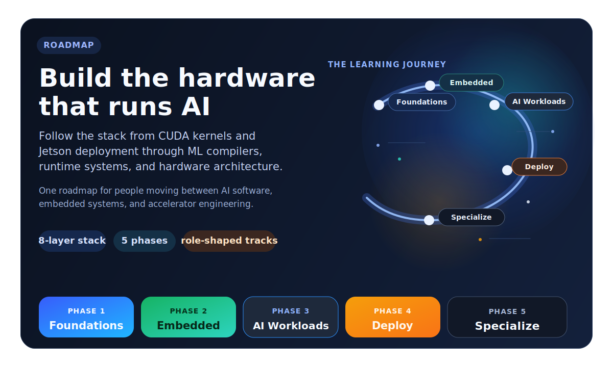
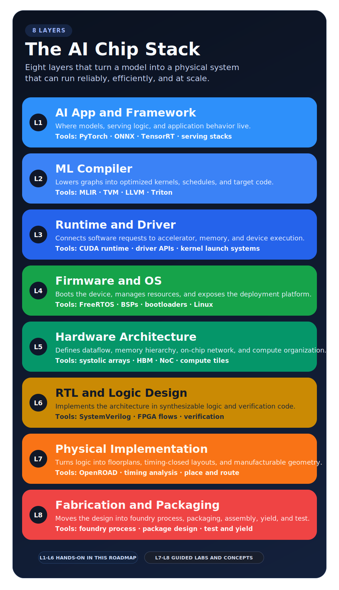

[⭐ Star this repo](https://github.com/ai-hpc/ai-hardware-engineer-roadmap)

---

## What is this?

This repository is a **hardware-first roadmap** for people who want to become AI hardware engineers.

It sits in the gap between "I can use AI frameworks" and "I can explain how models map onto compilers, runtimes, boards, and chips." The repository connects the layers that are usually learned separately: digital design, computer architecture, operating systems, parallel programming, embedded systems, AI workloads, deployment, ML compilers, and accelerator design.

The goal is not to collect random resources or to teach generic AI in isolation. The goal is to build **cross-stack engineering judgment**: how workloads create bottlenecks, how software reaches hardware, and how to design, optimize, deploy, or debug AI systems close to the silicon.

AI content in this repository exists to teach the workloads that hardware must serve. The center of gravity is still **hardware, systems, deployment, and performance**.

**By the end, you should be able to:**

- trace an AI workload from model code to compiler, runtime, and hardware behavior
- write and profile performance-critical code, including GPU and parallel workloads
- deploy AI on real embedded or programmable hardware such as Jetson and FPGA platforms
- reason about memory, latency, throughput, precision, and architecture tradeoffs

---

## Who is this for?

This repository is for engineers who want to move into **AI hardware work**, not just use AI tools at a high level.

It is built for people crossing into a neighboring layer of the stack:
- from software into performance, compilers, and hardware behavior
- from ML into deployment, systems, and runtime constraints
- from embedded into AI products and accelerator-backed inference
- from hardware into workloads, compiler flow, and software integration

- **Software Engineer:** Move from APIs and infrastructure into CUDA, runtime behavior, compiler flow, memory hierarchy, and accelerator execution.
- **ML / AI Engineer:** Connect quantization, batching, graph lowering, deployment, and inference behavior to the hardware limits that actually shape performance.
- **Embedded / Firmware Engineer:** Extend RTOS, Linux, drivers, BSP, and bring-up skills into Jetson, edge inference, sensor pipelines, and shipped AI devices.
- **Computer Science Student:** Use a structured path from fundamentals to systems, workloads, deployment, and specialization instead of guessing what to study next.
- **Hardware / RTL / FPGA Engineer:** Add workload intuition, compiler context, kernels, and deployment constraints so existing hardware knowledge maps to real AI systems.

---

## AI Chip Stack

This roadmap uses an **8-layer stack** to explain AI hardware work end to end. The point is not just to label layers. The point is to understand how decisions in one layer affect the others, from application code at the top to implementation and fabrication at the bottom.

> **L1–L6:** Hands-on throughout this roadmap.
> **L7–L8:** Included so the stack stays complete, with guided conceptual labs.

---

## Where Do I Start?

Pick the path that matches both your current background and your target role. Most people should choose one primary entry path first, then branch out later.

- **Software / ML:** Start with execution and performance. Path: `Phase 1 (C++ / Parallel) -> Phase 3 -> Phase 4C or 4B`. Best if you already build models or infrastructure and want to understand kernels, memory behavior, compiler lowering, and deployment constraints.
- **Embedded / Firmware:** Start with systems and deployment. Path: `Phase 1 (Architecture) -> Phase 2 -> Phase 4B`. Best if you already know boards, RTOS, buses, or Linux bring-up and want to move into edge AI products.
- **Already know CUDA:** Jump to specialized tracks. Path: `Phase 4A / 4B / 4C`. Best if profiling, kernels, and low-level performance already feel familiar.
- **Chip design target:** Follow the full hardware path. Path: `Phase 1 -> Phase 2 -> Phase 4A -> Phase 5F`. Best if your goal is accelerator architecture, FPGA prototyping, RTL implementation, or silicon-adjacent work.

---

## How To Use This Roadmap

Do not treat this repository like a book to finish once. Use it like a build-and-measure curriculum.

1. Read the theory
2. Build the subsystem or implementation
3. Measure performance, power, correctness, or utilization
4. Ship one reusable artifact

The artifact matters as much as the reading. Good outputs include a CUDA profile, TensorRT benchmark, device-tree patch, FPGA timing report, compiler experiment, or architecture write-up. The point is to leave each block with evidence of engineering work, not just notes.

Before you start, decide three things:

1. Which role or stack layer you are aiming at. Start with [Roles & Market Analysis](Roles%20and%20Market%20Analysis.md).
2. What hardware and toolchain you can actually use.
3. How you will track outputs, failures, measurements, and decisions.

---

## The 5 Phases

### [Phase 1 — Digital Foundations](Phase%201%20-%20Foundational%20Knowledge/Guide.md)
*Learn the language of hardware. Go from logic gates to writing GPU code.*

| Module | What you'll learn |
|--------|------------------|
| [Digital Design & HDL](Phase%201%20-%20Foundational%20Knowledge/1.%20Digital%20Design%20and%20Hardware%20Description%20Languages/Guide.md) | How digital logic works; write Verilog, simulate circuits |
| [Computer Architecture](Phase%201%20-%20Foundational%20Knowledge/2.%20Computer%20Architecture%20and%20Hardware/Guide.md) | How CPUs and GPUs work internally — pipelines, caches, memory |
| [Operating Systems](Phase%201%20-%20Foundational%20Knowledge/3.%20Operating%20Systems/Guide.md) | Processes, memory, scheduling, device drivers |
| [C++ & Parallel Computing](Phase%201%20-%20Foundational%20Knowledge/4.%20C%2B%2B%20and%20Parallel%20Computing/Guide.md) | SIMD, OpenMP, oneTBB, **CUDA**, ROCm, OpenCL/SYCL |

---

### [Phase 2 — Embedded Systems](Phase%202%20-%20Embedded%20Systems/Guide.md)
*Get hands-on with real hardware: microcontrollers, sensors, and embedded Linux.*

| Module | What you'll learn |
|--------|------------------|
| [Embedded Software](Phase%202%20-%20Embedded%20Systems/2.%20Embedded%20Software/Guide.md) | ARM Cortex-M, FreeRTOS, communication buses (SPI/I2C/CAN), power management |
| [Embedded Linux](Phase%202%20-%20Embedded%20Systems/3.%20Embedded%20Linux/Guide.md) | Build custom Linux for embedded devices with Yocto and PetaLinux |

---

### [Phase 3 — Artificial Intelligence](Phase%203%20-%20Artificial%20Intelligence/Guide.md)
*Understand the AI workloads your hardware must run. Two tracks — pick one or both.*

**Core (everyone does these):**

| Module | What you'll learn |
|--------|------------------|
| [Neural Networks](Phase%203%20-%20Artificial%20Intelligence/1.%20Neural%20Networks/Guide.md) | How neural networks learn — backprop, CNNs, transformers from scratch |
| [Deep Learning Frameworks](Phase%203%20-%20Artificial%20Intelligence/2.%20Deep%20Learning%20Frameworks/Guide.md) | micrograd → PyTorch → tinygrad: understand what frameworks actually do |

**Track A — Hardware & Edge AI** *(leads to Phase 4A/B)*

| Module | What you'll learn |
|--------|------------------|
| [Computer Vision](Phase%203%20-%20Artificial%20Intelligence/Track%20A%20-%20Hardware%20and%20Edge%20AI/3.%20Computer%20Vision/Guide.md) | Object detection, segmentation, 3D vision, OpenCV |
| [Sensor Fusion](Phase%203%20-%20Artificial%20Intelligence/Track%20A%20-%20Hardware%20and%20Edge%20AI/4.%20Sensor%20Fusion/Guide.md) | Fuse camera + LiDAR + IMU; Kalman filters, BEVFusion |
| [Voice AI](Phase%203%20-%20Artificial%20Intelligence/Track%20A%20-%20Hardware%20and%20Edge%20AI/5.%20Voice%20AI/Guide.md) | Speech-to-text (Whisper), TTS, wake-word detection |
| [Edge AI & Optimization](Phase%203%20-%20Artificial%20Intelligence/Track%20A%20-%20Hardware%20and%20Edge%20AI/6.%20Edge%20AI%20and%20Model%20Optimization/Guide.md) | Quantization, pruning, deploying models on constrained devices |

**Track B — Agentic AI & ML Engineering** *(leads to Phase 4C / Phase 5)*

| Module | What you'll learn |
|--------|------------------|
| [Agentic AI & GenAI](Phase%203%20-%20Artificial%20Intelligence/Track%20B%20-%20Agentic%20AI%20and%20ML%20Engineering/3.%20Agentic%20AI%20and%20GenAI/Guide.md) | Build LLM agents, RAG systems, tool-using AI |
| [ML Engineering & MLOps](Phase%203%20-%20Artificial%20Intelligence/Track%20B%20-%20Agentic%20AI%20and%20ML%20Engineering/4.%20ML%20Engineering%20and%20MLOps/Guide.md) | Training pipelines, model serving, monitoring |
| [LLM Application Development](Phase%203%20-%20Artificial%20Intelligence/Track%20B%20-%20Agentic%20AI%20and%20ML%20Engineering/5.%20LLM%20Application%20Development/Guide.md) | Fine-tuning, RAG architecture, production LLM apps |

---

### Phase 4 — Hardware Deployment & Compilation
*Deploy AI on real chips. Three specialized tracks — choose based on your target role.*

#### Track A — Xilinx FPGA
*Design hardware accelerators and deploy AI on programmable chips.*

| Module | What you'll learn |
|--------|------------------|
| [FPGA Development](Phase%204%20-%20Track%20A%20-%20Xilinx%20FPGA/1.%20Xilinx%20FPGA%20Development/Guide.md) | Vivado, IP cores, timing constraints, hardware debugging |
| [Zynq MPSoC](Phase%204%20-%20Track%20A%20-%20Xilinx%20FPGA/2.%20Zynq%20UltraScale%2B%20MPSoC/Guide.md) | Combine ARM CPU + FPGA fabric on one chip |
| [Advanced FPGA Design](Phase%204%20-%20Track%20A%20-%20Xilinx%20FPGA/3.%20Advanced%20FPGA%20Design/Guide.md) | Clock domain crossing, floorplanning, power |
| [HLS (High-Level Synthesis)](Phase%204%20-%20Track%20A%20-%20Xilinx%20FPGA/4.%20High-Level%20Synthesis%20%28HLS%29/Guide.md) | Write C++ → get hardware automatically |
| [Runtime & Drivers](Phase%204%20-%20Track%20A%20-%20Xilinx%20FPGA/5.%20Runtime%20and%20Driver%20Development/Guide.md) | Linux driver for your FPGA, DMA, Vitis AI |
| [Projects](Phase%204%20-%20Track%20A%20-%20Xilinx%20FPGA/6.%20Projects/Wireless-Video-FPGA.md) | Build a 4K wireless video pipeline end-to-end |

#### Track B — NVIDIA Jetson
*Ship AI products on NVIDIA's embedded GPU platform.*

| Module | What you'll learn |
|--------|------------------|
| [Jetson Platform](Phase%204%20-%20Track%20B%20-%20Nvidia%20Jetson/1.%20Nvidia%20Jetson%20Platform/Guide.md) | JetPack, L4T, GPU on Orin — get up and running |
| [Carrier Board Design](Phase%204%20-%20Track%20B%20-%20Nvidia%20Jetson/2.%20Custom%20Carrier%20Board%20Design%20and%20Bring-Up/Guide.md) | Design your own PCB that hosts a Jetson module |
| [L4T Customization](Phase%204%20-%20Track%20B%20-%20Nvidia%20Jetson/3.%20L4T%20Customization/Guide.md) | Custom Linux kernel, device tree, OTA updates |
| [Firmware (FSP)](Phase%204%20-%20Track%20B%20-%20Nvidia%20Jetson/4.%20FSP%20%28Firmware%20Support%20Package%29%20Customization/Guide.md) | FreeRTOS on the safety co-processor |
| [AI Application Dev](Phase%204%20-%20Track%20B%20-%20Nvidia%20Jetson/5.%20Application%20Development/Guide.md) | ML inference, ROS 2, real-time video on Jetson |
| [Security & OTA](Phase%204%20-%20Track%20B%20-%20Nvidia%20Jetson/6.%20Security%20and%20OTA/Guide.md) | Secure boot, encrypted storage, over-the-air updates |
| [Manufacturing](Phase%204%20-%20Track%20B%20-%20Nvidia%20Jetson/7.%20Compliance%20and%20Manufacturing/Guide.md) | FCC/CE compliance, production flashing, DFM |
| [TensorRT & DLA](Phase%204%20-%20Track%20B%20-%20Nvidia%20Jetson/8.%20Runtime%20and%20Driver%20Development/Guide.md) | Optimize models for Jetson's GPU and neural accelerator |

#### Track C — ML Compiler
*Learn how AI models are compiled and optimized into chip instructions.*

| Module | What you'll learn |
|--------|------------------|
| [Compiler Fundamentals](Phase%204%20-%20Track%20C%20-%20ML%20Compiler%20and%20Graph%20Optimization/Guide.md) | How MLIR, TVM, and LLVM work; build a custom backend |
| [DL Inference Optimization](Phase%204%20-%20Track%20C%20-%20ML%20Compiler%20and%20Graph%20Optimization/DL%20Inference%20Optimization/Guide.md) | Triton kernels, Flash-Attention, TensorRT-LLM, quantization |

Start here:
- [Track A — Xilinx FPGA](Phase%204%20-%20Track%20A%20-%20Xilinx%20FPGA/1.%20Xilinx%20FPGA%20Development/Guide.md)
- [Track B — NVIDIA Jetson](Phase%204%20-%20Track%20B%20-%20Nvidia%20Jetson/1.%20Nvidia%20Jetson%20Platform/Guide.md)
- [Track C — ML Compiler](Phase%204%20-%20Track%20C%20-%20ML%20Compiler%20and%20Graph%20Optimization/Guide.md)

---

### [Phase 5 — Specialization](Phase%205%20-%20Advanced%20Topics%20and%20Specialization/Guide.md)
*Go deep in one area. These tracks are ongoing and expand continuously.*

| Track | What you'll specialize in | Guide |
|-------|--------------------------|-------|
| **GPU Infrastructure** | Multi-GPU systems, NVLink, NCCL, AMD ROCm/HIP, MI300X | [→](Phase%205%20-%20Advanced%20Topics%20and%20Specialization/1.%20GPU%20Infrastructure/Guide.md) |
| **High-Performance Computing** | 40+ CUDA-X libraries: cuBLAS, cuDNN, NVSHMEM and more | [→](Phase%205%20-%20Advanced%20Topics%20and%20Specialization/2.%20High%20Performance%20Computing/Guide.md) |
| **Edge AI** | Efficient model architectures, Holoscan, real-time pipelines | [→](Phase%205%20-%20Advanced%20Topics%20and%20Specialization/3.%20Edge%20AI/Guide.md) |
| **Robotics** | ROS 2, Nav2, MoveIt, motion planning | [→](Phase%205%20-%20Advanced%20Topics%20and%20Specialization/4.%20Robotics/Guide.md) |
| **Autonomous Vehicles** | openpilot, BEV perception, functional safety, hardware debug | [→](Phase%205%20-%20Advanced%20Topics%20and%20Specialization/5.%20Autonomous%20Vehicles/Guide.md) |
| **AI Chip Design** | Systolic arrays, dataflow architectures, tinygrad↔hardware, ASIC flow | [→](Phase%205%20-%20Advanced%20Topics%20and%20Specialization/6.%20AI%20Chip%20Design/Guide.md) |

---

## What Jobs Does This Lead To?

| Target Role | Key Layers | Recommended Path |
|-------------|-----------|-----------------|
| **ML Inference Engineer** | L1 | Phase 3 → Phase 4C |
| **Edge AI Engineer** | L1 | Phase 3 Track A → Phase 4B |
| **AI Compiler Engineer** | L2 | Phase 1 → Phase 4C → Phase 5B |
| **GPU Runtime Engineer** | L3 | Phase 1 (CUDA) → Phase 4A/B §Runtime |
| **Firmware / Embedded Engineer** | L4 | Phase 1 → Phase 2 → Phase 4B |
| **AI Accelerator Architect** | L5 | Phase 1 → Phase 4A → Phase 5F |
| **RTL / FPGA Design Engineer** | L6 | Phase 1 (HDL) → Phase 4A |
| **Autonomous Vehicles Engineer** | L1–L4 | Phase 3 Track A → Phase 4B → Phase 5E |
| **AI Hardware Engineer (Full-Stack)** | L1–L6 | Full curriculum — the signature role this roadmap targets |

---

## Reference Projects Used Throughout

| Project | Why it's used |
|---------|--------------|
| [**tinygrad**](https://github.com/tinygrad/tinygrad) | A tiny DL framework (~2,500 lines) — shows exactly how frameworks, compilers, and hardware backends connect |
| [**openpilot**](https://github.com/commaai/openpilot) | Real-world ADAS software — shows how perception, ML, and hardware work together in production |
| [**jetson-llm-runtime**](Projects/jetson-llm-runtime/README.md) | A highly optimized Jetson LLM runtime project — useful for studying inference kernels, memory behavior, runtime design, build flow, and edge deployment tradeoffs |

---

## Additional Resources

- [**Roles & Market Analysis**](Roles%20and%20Market%20Analysis.md) — 23 sub-roles, salary data, job postings, remote %, hiring priorities
- [**Curriculum Authoring Guide**](Curriculum-Authoring-Guide.md) — how to add new modules, labs, and projects without losing the repo's hardware-first focus

---

**A hardware-first roadmap for people learning to build, deploy, and optimize AI systems close to the silicon.**

[⭐ Star this repo](https://github.com/ai-hpc/ai-hardware-engineer-roadmap) if you find it useful — it helps others discover it.

