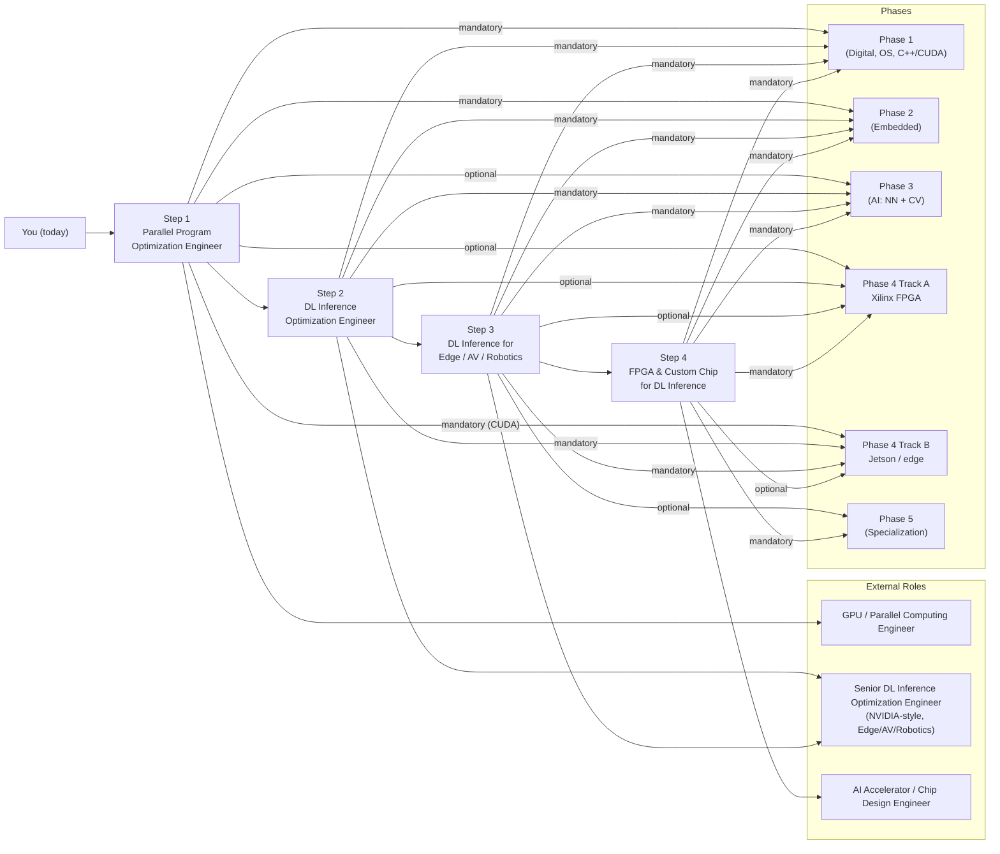

# AI Hardware Engineer Roadmap

**From Kernel-Level Parallel Programming to Custom AI Inference Accelerator Design — powered by NVIDIA GPUs, Jetson, and tinygrad** 

## The Four Career Steps

Each step is a **concrete role target** built on the **5-phase** curriculum below. **Phase 4** runs two parallel hardware tracks: **Track A — Xilinx FPGA** and **Track B — Nvidia Jetson / edge AI**.

| Step | Role target | Common titles (same step) | Focus | Outcome |
|:----:|-------------|----------------------------|-------|---------|
| **1** | **Parallel Program Optimization Engineer** | — | CUDA/OpenCL kernels, memory hierarchy, warp/SM behavior, tinygrad backends | Read kernel traces, identify memory vs compute bottlenecks, optimize parallel programs on GPU/SoC |
| **2** | **DL Inference Optimization Engineer** | — | Model/operator optimization, TensorRT, tinygrad compiler (IR, scheduling, BEAM), quantization | Take a model from graph to optimized deployment with measurable latency/throughput improvement |
| **3** | **DL Inference for Edge / AV / Robotics** | **Embedded Software Engineer**, **Embedded Linux Engineer** | Power/latency-constrained deployment, sensor→actuation pipeline, openpilot/Jetson/DRIVE; MCU/RTOS + Linux BSP next to the ML stack | Own inference optimization for edge/AV/robotics; hit latency and power targets on real SoCs |
| **4** | **FPGA & Custom Chip for DL Inference** | **FPGA Engineer** (RTL/HLS/prototyping) | Mapping inference to hardware, HLS/RTL, accelerator architecture (systolic, dataflow), ASIC path | Design and implement FPGA accelerators for DL workloads; understand the custom-chip design path |

**Reference projects** used throughout all four steps:

| Project | Step 1 | Step 2 | Step 3 | Step 4 |
|---------|--------|--------|--------|--------|
| **[tinygrad](https://github.com/tinygrad/tinygrad)** | Trace ops→kernels, study backends | IR, scheduling, BEAM, quantization | On-device inference under edge constraints | Custom backend; workload for accelerator design |
| **[openpilot](https://github.com/commaai/openpilot)** | — | Why inference optimization matters in production | Full AV stack: camera→ISP→modeld→planning→CAN | Real workloads (vision, policy) for hardware design |

---

## 5-Phase Curriculum

### Phase 1: Digital Foundations (6–12 months)

| Topic | Key Skills | AI connection |
|-------|------------|-----------------|
| [**Digital Design Fundamentals**](Phase%201%20-%20Foundational%20Knowledge/1.%20Digital%20Design%20Fundamentals/Guide.md) | Number systems, Boolean algebra, combinational/sequential logic, memory (SRAM, DRAM, ROM) | *MAC units, memory bandwidth, and data types (INT8, FP16) that power AI inference start here* |
| [**Hardware Description Languages**](Phase%201%20-%20Foundational%20Knowledge/2.%20Hardware%20Description%20Languages%20(HDLs)/Guide.md) | Verilog syntax, behavioral/dataflow/structural modeling, testbenches, synthesis | *The language you will use to design AI accelerator datapaths* |
| [**Computer Architecture and Hardware**](Phase%201%20-%20Foundational%20Knowledge/3.%20Computer%20Architecture%20and%20Hardware/Guide.md) | ISA through microarchitecture (pipelines, caches, OoO, coherence); labs; modern CPUs/GPUs/memory/storage/I/O | *Same limits (bandwidth, latency, power) govern TinyML through data-center GPUs* |
| [**Operating Systems**](Phase%201%20-%20Foundational%20Knowledge/4.%20Operating%20Systems/Guide.md) | Processes, threads, scheduling, memory management, synchronization, drivers, filesystems | *OS underpins Linux, RTOS, and all deployment targets; 24-lecture Linux internals* |
| [**Deep C++ and Parallel computing with CUDA**](Phase%201%20-%20Foundational%20Knowledge/5.%20Deep%20C%2B%2B%20and%20Parallel%20computing%20with%20CUDA/Guide.md) | Modern C++, CPU threading, CUDA model, streams; vector/matmul/reduction projects | *Host + kernel skills before Phase 3 NN math* |

**Projects:** Calculator on breadboard, FPGA digital clock, traffic light controller, UART module, basic RISC-V core, CUDA vector/SAXPY/matmul + CPU reference checks

---

### Phase 2: Embedded Systems (6–12 months)

| Topic | Key Skills | AI connection |
|-------|------------|-----------------|
| [**Embedded Software**](Phase%202%20-%20Embedded%20Systems/1.%20Embedded%20Software/Guide.md) | ARM Cortex-M, FreeRTOS, SPI/UART/I2C/CAN, power, OTA | *Sensor buses and real-time tasks next to inference* |
| [**Embedded Linux**](Phase%202%20-%20Embedded%20Systems/2.%20Embedded%20Linux/Guide.md) | Yocto, PetaLinux, kernel, rootfs | *Jetson and edge products ship on embedded Linux* |

**Projects:** FreeRTOS sensor pipeline, DMA UART, SPI IMU, CAN network, MCUboot, Yocto image

---

### Phase 3: Artificial Intelligence (6–12 months)

> *Hub:* [**Phase 3 — Artificial Intelligence**](Phase%203%20-%20Artificial%20Intelligence/Guide.md)

| Topic | Key Skills | AI connection |
|-------|------------|-----------------|
| [**Neural Networks and Edge AI**](Phase%203%20-%20Artificial%20Intelligence/Neural%20Networks%20and%20Edge%20AI/Guide.md) | MLPs, CNNs, training, tinygrad, PyTorch; [pytorch-and-micrograd](Phase%203%20-%20Artificial%20Intelligence/Neural%20Networks%20and%20Edge%20AI/pytorch-and-micrograd/Guide.md) | *What accelerators must implement — tensors, ops, autodiff* |
| [**Computer Vision**](Phase%203%20-%20Artificial%20Intelligence/Computer%20Vision/Guide.md) | Image processing, detection, OpenCV | *Perception stack before Phase 4 Track A (FPGA) or Track B (Jetson)* |

**Projects:** micrograd, CNN from scratch, tinygrad tutorials, OpenCV / detection exercises

---

### Phase 4: Hardware deployment (6–12 months each track)

Pick **Track A (Xilinx)**, **Track B (Jetson)**, or both (typical for accelerator + edge roles).

#### Phase 4 Track A — Xilinx FPGA

| Topic | Key Skills | AI connection |
|-------|------------|-----------------|
| [**Xilinx FPGA Development**](Phase%204%20-%20Track%20A%20-%20Xilinx%20FPGA/1.%20Xilinx%20FPGA%20Development/Guide.md) | Vivado, IP, timing, ILA/VIO | *AI accelerator prototyping (FINN, Vitis AI)* |
| [**Zynq UltraScale+ MPSoC**](Phase%204%20-%20Track%20A%20-%20Xilinx%20FPGA/2.%20Zynq%20UltraScale%2B%20MPSoC/Guide.md) | PS/PL, Linux on Zynq | *CPU + accelerator SoC template* |
| [**Advanced FPGA Design**](Phase%204%20-%20Track%20A%20-%20Xilinx%20FPGA/3.%20Advanced%20FPGA%20Design/Guide.md) | CDC, floorplanning, power, PR | *Production FPGA AI* |
| [**HLS**](Phase%204%20-%20Track%20A%20-%20Xilinx%20FPGA/4.%20High-Level%20Synthesis%20%28HLS%29/Guide.md) | C→RTL, dataflow, pipelining | *Conv/matmul accelerators* |
| [**OpenCL**](Phase%204%20-%20Track%20A%20-%20Xilinx%20FPGA/5.%20OpenCL/Guide.md) | Kernels, heterogeneous CPU/GPU/FPGA | *Portable parallel model* |

**Projects:** Matmul/conv accelerators, image pipeline, NN on FPGA, CPU vs GPU vs FPGA benchmarks

#### Phase 4 Track B — Nvidia Jetson & Edge AI

| Topic | Key Skills | Projects |
|-------|------------|----------|
| [**Nvidia Jetson Platform**](Phase%204%20-%20Track%20B%20-%20Nvidia%20Jetson%20and%20Edge%20AI/1.%20Nvidia%20Jetson%20Platform/Guide.md) | Orin Nano, JetPack, L4T, CUDA | Detection, deployment, robot |
| [**Edge AI Optimization**](Phase%204%20-%20Track%20B%20-%20Nvidia%20Jetson%20and%20Edge%20AI/2.%20Edge%20AI%20Optimization/Guide.md) | Quantization, TensorRT, CUDA | Orin pipeline, analytics |
| [**Sensor Fusion**](Phase%204%20-%20Track%20B%20-%20Nvidia%20Jetson%20and%20Edge%20AI/3.%20Sensor%20Fusion/Guide.md) | Camera, LiDAR, IMU, Kalman, BEVFusion | Robot, drone, mapping |
| [**ROS2**](Phase%204%20-%20Track%20B%20-%20Nvidia%20Jetson%20and%20Edge%20AI/4.%20ROS2/Guide.md) | DDS, nodes, topics | Multi-robot, edge |
| [**OrinClaw**](Phase%204%20-%20Track%20B%20-%20Nvidia%20Jetson%20and%20Edge%20AI/5.%20OpenClaw%20Assistant%20Box/Guide.md) | Product-style edge AI, OTA, privacy | Orin Nano assistant capstone |

---

### Phase 5: Specialization tracks (ongoing)

> *Prerequisites:* **Phases 1–2**, **Phase 3** as needed for ML literacy, and the **Phase 4 Track A / Track B** modules noted per row.

| Track | Prerequisites | Focus | Guide |
|-------|--------------|-------|-------|
| **A: Autonomous Driving** | Phase 3 (**Computer Vision**), Phase 4 Track B — Jetson (**Sensor Fusion**, **Edge AI**) | openpilot, tinygrad on-device, ISP, BEV | [Guide →](Phase%205%20-%20Advanced%20Topics%20and%20Specialization/4.%20Autonomous%20Driving/Guide.md) |
| **B: AI Chip Design** | Phase 4 Track A — Xilinx (**HLS**, advanced FPGA), Phase 3 (**Neural Networks**) | Systolic arrays, dataflow, tinygrad↔hardware, ASIC path | [Guide →](Phase%205%20-%20Advanced%20Topics%20and%20Specialization/5.%20AI%20Chip%20Design/Guide.md) |
| **C: HPC & GPU Infrastructure** | Phase 4 Track B — Jetson (CUDA stack) | NCCL, NVLink, IB, GPUDirect, DL inference optimization | [Guide →](Phase%205%20-%20Advanced%20Topics%20and%20Specialization/1.%20HPC%20and%20DL%20with%20Nvidia%20GPU/Guide.md) |
| **D: Robotics** | Phase 4 Track B — Jetson (**ROS2**, **Sensor Fusion**) | Nav2, MoveIt, planning | [Guide →](Phase%205%20-%20Advanced%20Topics%20and%20Specialization/3.%20Robotics%20Application/Guide.md) |
| **E: Real Time Edge AI (Jetson)** | Phases 1–2, Phase 4 Track B — Jetson | Efficient nets, quantization, Holoscan | [Guide →](Phase%205%20-%20Advanced%20Topics%20and%20Specialization/2.%20Real%20Time%20Edge%20AI%20with%20Nvidia%20Jetson/Guide.md) |

---

## Career Paths

The **[four career steps](#the-four-career-steps)** above are the **progression**. The tables below map **job titles** to **curriculum depth**.

### By career step (1–4)

| Career step | Role titles (examples) | Phases you lean on most | Phase 5 specialization (if any) |
|:-----------:|------------------------|-------------------------|----------------------------------|
| **1** — Parallel Program Optimization | GPU / CUDA Engineer, Performance Engineer (GPU) | [1](Phase%201%20-%20Foundational%20Knowledge) (architecture + §5 CUDA), [4B Jetson](Phase%204%20-%20Track%20B%20-%20Nvidia%20Jetson%20and%20Edge%20AI) | [C: HPC](Phase%205%20-%20Advanced%20Topics%20and%20Specialization/1.%20HPC%20and%20DL%20with%20Nvidia%20GPU/Guide.md) |
| **2** — DL Inference Optimization | TensorRT / ORT Engineer, Compiler Backend (ML) | [1](Phase%201%20-%20Foundational%20Knowledge), [3](Phase%203%20-%20Artificial%20Intelligence/Neural%20Networks%20and%20Edge%20AI/Guide.md), [4B Jetson](Phase%204%20-%20Track%20B%20-%20Nvidia%20Jetson%20and%20Edge%20AI) | [C: HPC](Phase%205%20-%20Advanced%20Topics%20and%20Specialization/1.%20HPC%20and%20DL%20with%20Nvidia%20GPU/Guide.md) |
| **3** — Edge / AV / Robotics | Edge ML, Jetson, perception, robotics; **Embedded SW**, **Embedded Linux** | [1](Phase%201%20-%20Foundational%20Knowledge)–[2](Phase%202%20-%20Embedded%20Systems), [3](Phase%203%20-%20Artificial%20Intelligence/Guide.md), [4B Jetson](Phase%204%20-%20Track%20B%20-%20Nvidia%20Jetson%20and%20Edge%20AI) | [A](Phase%205%20-%20Advanced%20Topics%20and%20Specialization/4.%20Autonomous%20Driving/Guide.md), [D](Phase%205%20-%20Advanced%20Topics%20and%20Specialization/3.%20Robotics%20Application/Guide.md), [E](Phase%205%20-%20Advanced%20Topics%20and%20Specialization/2.%20Real%20Time%20Edge%20AI%20with%20Nvidia%20Jetson/Guide.md) |
| **4** — FPGA & custom silicon | FPGA / RTL / AI Silicon; **FPGA Engineer** | [1](Phase%201%20-%20Foundational%20Knowledge)–[4A Xilinx](Phase%204%20-%20Track%20A%20-%20Xilinx%20FPGA), optional [4B Jetson](Phase%204%20-%20Track%20B%20-%20Nvidia%20Jetson%20and%20Edge%20AI) | [B: AI Chip Design](Phase%205%20-%20Advanced%20Topics%20and%20Specialization/5.%20AI%20Chip%20Design/Guide.md) |

### By phase depth

| Phase | Typical roles | Notes |
|:-----:|---------------|-------|
| **[1](Phase%201%20-%20Foundational%20Knowledge)** | Software engineer with hardware literacy | Digital, OS, CUDA — no dedicated NN course here |
| **[2](Phase%202%20-%20Embedded%20Systems)** | MCU / RTOS, Embedded Linux / Yocto | Feeds Jetson products |
| **[3](Phase%203%20-%20Artificial%20Intelligence/Guide.md)** | ML engineer (graphs, CV pipelines) | NN + OpenCV before hardware mapping |
| **[4A Xilinx](Phase%204%20-%20Track%20A%20-%20Xilinx%20FPGA)** | FPGA / RTL / HLS engineer | **FPGA Engineer** |
| **[4B Jetson](Phase%204%20-%20Track%20B%20-%20Nvidia%20Jetson%20and%20Edge%20AI)** | Jetson, TensorRT, fusion, ROS2, embedded titles | **Embedded Software / Linux** often here |
| **[5](Phase%205%20-%20Advanced%20Topics%20and%20Specialization)** | ADAS, HPC infra, robotics depth, accelerator architect | Tracks A–E above |

### Quick lookup: role → phases

| Role | Primary phases | Typical career step | Phase 5 |
|------|---------------|---------------------|---------|
| Parallel Program Optimization Engineer | [1](Phase%201%20-%20Foundational%20Knowledge), [4B Jetson](Phase%204%20-%20Track%20B%20-%20Nvidia%20Jetson%20and%20Edge%20AI) | 1 | [C](Phase%205%20-%20Advanced%20Topics%20and%20Specialization/1.%20HPC%20and%20DL%20with%20Nvidia%20GPU/Guide.md) |
| DL Inference Optimization Engineer | [1](Phase%201%20-%20Foundational%20Knowledge), [3](Phase%203%20-%20Artificial%20Intelligence/Neural%20Networks%20and%20Edge%20AI/Guide.md), [4B Jetson](Phase%204%20-%20Track%20B%20-%20Nvidia%20Jetson%20and%20Edge%20AI) | 2 | [C](Phase%205%20-%20Advanced%20Topics%20and%20Specialization/1.%20HPC%20and%20DL%20with%20Nvidia%20GPU/Guide.md) |
| Edge ML / Jetson deployment | [1](Phase%201%20-%20Foundational%20Knowledge)–[2](Phase%202%20-%20Embedded%20Systems), [3](Phase%203%20-%20Artificial%20Intelligence/Guide.md), [4B Jetson](Phase%204%20-%20Track%20B%20-%20Nvidia%20Jetson%20and%20Edge%20AI) | 3 | [E](Phase%205%20-%20Advanced%20Topics%20and%20Specialization/2.%20Real%20Time%20Edge%20AI%20with%20Nvidia%20Jetson/Guide.md) |
| **Embedded Software Engineer** | [1](Phase%201%20-%20Foundational%20Knowledge), [2](Phase%202%20-%20Embedded%20Systems) | Supports step 3 | — |
| **Embedded Linux Engineer** | [1](Phase%201%20-%20Foundational%20Knowledge), [2](Phase%202%20-%20Embedded%20Systems) | Supports step 3 | — |
| **FPGA Engineer** | [1](Phase%201%20-%20Foundational%20Knowledge), [4A Xilinx](Phase%204%20-%20Track%20A%20-%20Xilinx%20FPGA) | 4 | [B](Phase%205%20-%20Advanced%20Topics%20and%20Specialization/5.%20AI%20Chip%20Design/Guide.md) |
| Perception / Sensor Fusion | [3](Phase%203%20-%20Artificial%20Intelligence/Computer%20Vision/Guide.md), [4B Jetson](Phase%204%20-%20Track%20B%20-%20Nvidia%20Jetson%20and%20Edge%20AI) | 3 | [A](Phase%205%20-%20Advanced%20Topics%20and%20Specialization/4.%20Autonomous%20Driving/Guide.md) or [D](Phase%205%20-%20Advanced%20Topics%20and%20Specialization/3.%20Robotics%20Application/Guide.md) |
| ADAS / Autonomous Driving | [1](Phase%201%20-%20Foundational%20Knowledge)–[2](Phase%202%20-%20Embedded%20Systems), [4B Jetson](Phase%204%20-%20Track%20B%20-%20Nvidia%20Jetson%20and%20Edge%20AI) | 3 | [A](Phase%205%20-%20Advanced%20Topics%20and%20Specialization/4.%20Autonomous%20Driving/Guide.md) |
| GPU / HPC / ML Infra | [1](Phase%201%20-%20Foundational%20Knowledge), [4B Jetson](Phase%204%20-%20Track%20B%20-%20Nvidia%20Jetson%20and%20Edge%20AI) | 1–2 | [C](Phase%205%20-%20Advanced%20Topics%20and%20Specialization/1.%20HPC%20and%20DL%20with%20Nvidia%20GPU/Guide.md) |

---

## About

**Who is this for?** EE/ECE students, software ML engineers, embedded engineers, and career changers targeting AI accelerators, edge AI, or autonomous systems. **Phase 3** assumes Phase 1 (through CUDA); prior ML course not required.

**Prerequisites:** Algebra/calculus · C or Python · Linux or WSL · FPGA board recommended for **Phase 4 Track A (Xilinx)**

**Estimated timeline:** ~2.5–5 years part-time (~10–15 hrs/week). Full-time learners move faster.

---

**Built for the AI hardware community** · [Star ⭐](https://github.com/ai-hpc/ai-hardware-engineer-roadmap) if you find this useful

