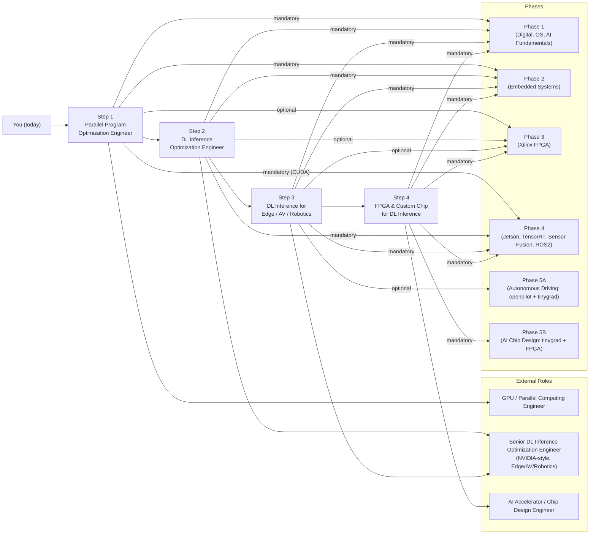

# AI Hardware Engineer Roadmap

**From Kernel-Level Parallel Programming to Custom AI Inference Accelerator Design — powered by NVIDIA GPUs, Jetson, and tinygrad** 

## The Four Career Steps

Each step is a **concrete role target** built on the 5-phase curriculum below.

| Step | Role Target | Focus | Outcome |
|:----:|-------------|-------|---------|
| **1** | **Parallel Program Optimization Engineer** | CUDA/OpenCL kernels, memory hierarchy, warp/SM behavior, tinygrad backends | Read kernel traces, identify memory vs compute bottlenecks, optimize parallel programs on GPU/SoC |
| **2** | **DL Inference Optimization Engineer** | Model/operator optimization, TensorRT, tinygrad compiler (IR, scheduling, BEAM), quantization | Take a model from graph to optimized deployment with measurable latency/throughput improvement |
| **3** | **DL Inference for Edge / AV / Robotics** | Power/latency-constrained deployment, sensor→actuation pipeline, openpilot/Jetson/DRIVE | Own inference optimization for edge/AV/robotics; hit latency and power targets on real SoCs |
| **4** | **FPGA & Custom Chip for DL Inference** | Mapping inference to hardware, HLS/RTL, accelerator architecture (systolic, dataflow), ASIC path | Design and implement FPGA accelerators for DL workloads; understand the custom-chip design path |

**Reference projects** used throughout all four steps:

| Project | Step 1 | Step 2 | Step 3 | Step 4 |
|---------|--------|--------|--------|--------|
| **[tinygrad](https://github.com/tinygrad/tinygrad)** | Trace ops→kernels, study backends | IR, scheduling, BEAM, quantization | On-device inference under edge constraints | Custom backend; workload for accelerator design |
| **[openpilot](https://github.com/commaai/openpilot)** | — | Why inference optimization matters in production | Full AV stack: camera→ISP→modeld→planning→CAN | Real workloads (vision, policy) for hardware design |

---

## 5-Phase Curriculum

### Phase 1: Digital Foundations (6–12 months)

| Topic | Key Skills | AI Connection |
|-------|------------|---------------|
| [**Digital Design Fundamentals**](Phase%201%20-%20Foundational%20Knowledge/1.%20Digital%20Design%20Fundamentals/Guide.md) | Number systems, Boolean algebra, combinational/sequential logic, memory (SRAM, DRAM, ROM) | *MAC units, memory bandwidth, and data types (INT8, FP16) that power AI inference start here* |
| [**Hardware Description Languages**](Phase%201%20-%20Foundational%20Knowledge/2.%20Hardware%20Description%20Languages%20(HDLs)/Guide.md) | Verilog syntax, behavioral/dataflow/structural modeling, testbenches, synthesis | *The language you will use to design AI accelerator datapaths* |
| [**Computer Hardware Basics**](Phase%201%20-%20Foundational%20Knowledge/3.%20Computer%20Hardware%20Basics/Guide.md) | Microcontroller architecture, C for embedded, RTOS concepts | *TinyML runs on microcontrollers; understanding hardware constraints is essential* |
| [**Operating Systems**](Phase%201%20-%20Foundational%20Knowledge/4.%20Operating%20Systems/Guide.md) | Processes, threads, scheduling (CFS/EEVDF/RT), memory management, synchronization, device drivers, filesystems | *OS underpins Linux, RTOS, and all AI deployment targets; 24-lecture curriculum covering modern Linux internals* |
| [**AI Fundamentals**](Phase%201%20-%20Foundational%20Knowledge/5.%20AI%20Fundamentals%20-%20Neural%20Networks%20and%20Edge%20AI/Guide.md) | Neural networks, backpropagation, CNNs, tinygrad, PyTorch | *Understanding what the hardware must compute — the bridge from digital foundations to AI acceleration* |

**Projects:** Calculator on breadboard, FPGA digital clock, traffic light controller, UART module, basic RISC-V core, micrograd implementation, CNN from scratch, tinygrad internals

---

### Phase 2: Embedded Systems (6–12 months)

| Topic | Key Skills | AI Connection |
|-------|------------|---------------|
| [**Embedded Software**](Phase%202%20-%20Embedded%20Systems/1.%20Embedded%20Software/Guide.md) | ARM Cortex-M architecture (CMSIS, MPU, TrustZone), FreeRTOS (tasks, queues, semaphores), SPI/UART/I2C/CAN drivers, power management, OTA updates | *Sensor pipelines (CAN, SPI, I2C) feed AI perception; FreeRTOS schedules real-time inference tasks; CAN/J1939 is how openpilot commands vehicle actuators* |
| [**Embedded Linux**](Phase%202%20-%20Embedded%20Systems/2.%20Embedded%20Linux/Guide.md) | Yocto, PetaLinux, kernel config, root filesystem | *Jetson, Qualcomm AI, and all edge AI platforms run embedded Linux* |

**Projects:** FreeRTOS sensor pipeline, DMA UART receiver, SPI IMU at max ODR, CAN two-node network, MCUboot secure bootloader, ultra-low-power IoT node, custom Yocto image

---

### Phase 3: Xilinx FPGA (6–12 months)

| Topic | Key Skills | AI Connection |
|-------|------------|---------------|
| [**Xilinx FPGA Development**](Phase%203%20-%20Xilinx%20FPGA/1.%20Xilinx%20FPGA%20Development/Guide.md) | Vivado flow, IP cores, block design, timing closure, ILA/VIO debugging | *FPGAs are the prototyping platform for AI accelerators (FINN, Vitis AI)* |
| [**Zynq UltraScale+ MPSoC**](Phase%203%20-%20Xilinx%20FPGA/2.%20Zynq%20UltraScale%2B%20MPSoC/Guide.md) | PS/PL integration, embedded Linux on Zynq, device drivers | *Heterogeneous SoCs like Zynq are the template for AI chips (CPU + accelerator)* |
| [**Advanced FPGA Design**](Phase%203%20-%20Xilinx%20FPGA/3.%20Advanced%20FPGA%20Design/Guide.md) | CDC, floorplanning, power optimization, partial reconfiguration | *Production FPGA accelerators for AI require timing closure, power budgets, and reconfiguration* |
| [**High-Level Synthesis (HLS)**](Phase%203%20-%20Xilinx%20FPGA/4.%20High-Level%20Synthesis%20%28HLS%29/Guide.md) | C/C++ to RTL, dataflow, loop unrolling, pipelining | *HLS is how you build CNN accelerators (conv2d, matmul) on FPGAs without writing RTL by hand* |
| [**OpenCL**](Phase%203%20-%20Xilinx%20FPGA/5.%20OpenCL/Guide.md) | Kernels, work-groups, heterogeneous computing (CPU/GPU/FPGA) | *The programming model for deploying AI workloads across different hardware targets* |
| [**Computer Vision**](Phase%203%20-%20Xilinx%20FPGA/6.%20Computer%20Vision/Guide.md) | Image processing, object detection, OpenCV | *The primary AI workload you will deploy on hardware: perception from pixels* |

**Projects:** Matrix multiply accelerator, convolution engine, image processing pipeline, neural network acceleration, CPU vs GPU vs FPGA benchmarking

---

### Phase 4: Nvidia Jetson & Edge AI (6–12 months)

> *Apply your AI and hardware foundations to real edge deployment: optimize and run models on Jetson, fuse sensors for perception, and build robotic systems with ROS2.*

| Topic | Key Skills | Projects |
|-------|------------|----------|
| [**Nvidia Jetson Platform**](Phase%204%20-%20Nvidia%20Jetson%20and%20Edge%20AI/1.%20Nvidia%20Jetson%20Platform/Guide.md) | Jetson Orin Nano, JetPack, L4T, CUDA, Nsight | Real-time object detection, custom model deployment, autonomous robot |
| [**Edge AI Optimization**](Phase%204%20-%20Nvidia%20Jetson%20and%20Edge%20AI/2.%20Edge%20AI%20Optimization/Guide.md) | Quantization, pruning, TensorRT, CUDA kernels | Optimized model on Orin Nano, video analytics, low-power AI pipeline |
| [**Sensor Fusion**](Phase%204%20-%20Nvidia%20Jetson%20and%20Edge%20AI/3.%20Sensor%20Fusion/Guide.md) | Camera + LiDAR + IMU, Kalman filtering, BEVFusion | Navigation robot, drone flight control, 3D mapping |
| [**ROS2**](Phase%204%20-%20Nvidia%20Jetson%20and%20Edge%20AI/4.%20ROS2/Guide.md) | ROS 2, DDS, nodes, topics, multi-robot systems | Robot navigation, multi-robot coordination, edge deployment |
| [**OrinClaw**](Phase%204%20-%20Nvidia%20Jetson%20and%20Edge%20AI/5.%20OpenClaw%20Assistant%20Box/Guide.md) (OpenClaw-based capstone) | Hardware-aware edge AI product design, low-power inference, on-device voice + automation, OTA, privacy/security | Jetson Orin Nano assistant box: **OrinClaw**, Alexa-level UX, offline-first |

---

### Phase 5: Specialization Tracks (Ongoing)

> *Choose one or more tracks based on your career goals. All tracks assume completion of Phases 1–4.*

| Track | Prerequisites | Focus | Guide |
|-------|--------------|-------|-------|
| **A: Autonomous Driving** | Phase 3 (Computer Vision), Phase 4 (Sensor Fusion, Edge AI) | openpilot architecture (camerad, modeld, planning, control), tinygrad on-device inference, camera ISP pipelines, BEV perception | [Guide →](Phase%205%20-%20Advanced%20Topics%20and%20Specialization/4.%20Autonomous%20Driving/Guide.md) |
| **B: AI Chip Design** | Phase 3 (HLS, Advanced FPGA), Phase 4 (AI Fundamentals) | Systolic arrays, dataflow architectures, tinygrad as hardware-software interface, FPGA prototyping, ASIC flow overview | [Guide →](Phase%205%20-%20Advanced%20Topics%20and%20Specialization/5.%20AI%20Chip%20Design/Guide.md) |
| **C: HPC & GPU Infrastructure** | Phase 4 (CUDA) | Multi-GPU NCCL, NVLink/NVSwitch, InfiniBand, RDMA, GPUDirect; includes **DL Inference Optimization** (graph/ops, kernels, compiler, quantization, runtimes) | [Guide →](Phase%205%20-%20Advanced%20Topics%20and%20Specialization/1.%20HPC%20and%20DL%20with%20Nvidia%20GPU/Guide.md) |
| **D: Robotics** | Phase 4 (ROS2, Sensor Fusion) | Nav2, MoveIt manipulation, motion planning, ROS-Industrial, sensor fusion for autonomous robots | [Guide →](Phase%205%20-%20Advanced%20Topics%20and%20Specialization/3.%20Robotics%20Application/Guide.md) |
| **E: Real Time Edge AI with Nvidia Jetson** | Phases 1–2, Phase 4 (Jetson, TensorRT) | Efficient architectures (MobileNet, EfficientNet, YOLO), quantization, TinyML, edge inference runtimes, **NVIDIA Jetson Holoscan**, system integration | [Guide →](Phase%205%20-%20Advanced%20Topics%20and%20Specialization/2.%20Real%20Time%20Edge%20AI%20with%20Nvidia%20Jetson/Guide.md) |

---

## Career Paths

| Role | Primary Phases | Specialization Track |
|------|---------------|---------------------|
| Parallel Program Optimization Engineer | [1](Phase%201%20-%20Foundational%20Knowledge)–[4](Phase%204%20-%20Nvidia%20Jetson%20and%20Edge%20AI) | — |
| **DL Inference Optimization Engineer** | [1](Phase%201%20-%20Foundational%20Knowledge)–[2](Phase%202%20-%20Embedded%20Systems), [4](Phase%204%20-%20Nvidia%20Jetson%20and%20Edge%20AI) | Track C: HPC |
| AI Accelerator / Chip Design Engineer | [1](Phase%201%20-%20Foundational%20Knowledge)–[4](Phase%204%20-%20Nvidia%20Jetson%20and%20Edge%20AI) | Track B: AI Chip Design |
| Real Time Edge AI with Nvidia Jetson Engineer | [1](Phase%201%20-%20Foundational%20Knowledge)–[2](Phase%202%20-%20Embedded%20Systems), [4](Phase%204%20-%20Nvidia%20Jetson%20and%20Edge%20AI) | Track E: Real Time Edge AI with Nvidia Jetson |
| ADAS / Autonomous Driving Engineer | [1](Phase%201%20-%20Foundational%20Knowledge)–[2](Phase%202%20-%20Embedded%20Systems), [4](Phase%204%20-%20Nvidia%20Jetson%20and%20Edge%20AI) | Track A: Autonomous Driving |
| GPU / HPC Infrastructure Engineer | [4](Phase%204%20-%20Nvidia%20Jetson%20and%20Edge%20AI) | Track C: HPC |
| Robotics Engineer | [2](Phase%202%20-%20Embedded%20Systems), [4](Phase%204%20-%20Nvidia%20Jetson%20and%20Edge%20AI) | Track D: Robotics |

---

## About

**Who is this for?** EE/ECE students, software ML engineers, embedded engineers, and career changers targeting AI accelerator design, edge AI, or autonomous systems. No prior AI/ML experience required — AI fundamentals are taught in Phase 1 after the hardware foundation.

**Prerequisites:** Basic algebra and calculus · C or Python · Linux or WSL · FPGA dev boards recommended from Phase 3

**Estimated timeline:** ~2.5–5 years part-time (~10–15 hrs/week). Full-time learners move significantly faster.

---

**Built for the AI hardware community** · [Star ⭐](https://github.com/ai-hpc/ai-hardware-engineer-roadmap) if you find this useful

